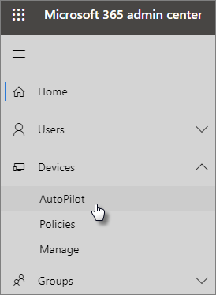

# Bruk veiledningen som forklarer trinn for trinn hvordan du legger til AutoPilot-enheter og -profilUse the step-by-step guide to add Autopilot devices and profile

Du kan bruke Windows AutoPilot til å konfigurere nye **Windows 10** enheter for bedriften, slik at de er klare til bruk når du gir dem til de ansatte.You can use Windows AutoPilot to set up **new** Windows 10 devices for your business so they're ready for use when you give them to your employees.
  
## EnhetskravDevice requirements

Enheter må oppfylle disse kravene:Devices must meet these requirements:
  
- Windows 10, versjon 1703 eller nyereWindows 10, version 1703 or later
    
- Nye enheter som ikke har vært gjennom Windows en ut-av-boks-opplevelseNew devices that haven't been through Windows out-of-box experience
    
## Bruk installasjonsveiledningen til å opprette enheter og profilerUse the setup guide to create devices and profiles

Hvis du ikke har opprettet enhetsgrupper eller profiler ennå, er den beste måten å komme i gang på ved hjelp av den trinnvise veiledningen.If you haven't created device groups or profiles yet, the best way to get started is by using the step-by-step guide. Du kan også [legge til enheter](create-and-edit-autopilot-devices.md) og tilordne [profiler](create-and-edit-autopilot-profiles.md) til dem uten å bruke veiledningen.You can also [add devices](create-and-edit-autopilot-devices.md) and [assign profiles](create-and-edit-autopilot-profiles.md) to them without using the guide. 
  
1. Gå til administrasjonssenteret på <a href="https://go.microsoft.com/fwlink/p/?linkid=837890" target="_blank">https://admin.microsoft.com</a> .Go to the admin center at <a href="https://go.microsoft.com/fwlink/p/?linkid=837890" target="_blank">https://admin.microsoft.com</a>.

2. Velg Enheter AutoPilot  i den venstre \> **navigasjonsruten.**On the left navigation pane, choose **Devices** \> **AutoPilot**.

    
  
2. Klikk eller **trykk startveiledning på AutoPilot-siden.** On the **AutoPilot** page, click or tap **Start guide**.
    
    
  
3. Gå **Upload .csv en fil** med liste over enheter på siden for å gå til en plassering der du har den .CSV filen, og deretter **åpne** \> **Neste**.On the **Upload .csv file with list of devices** page, browse to a location where you have the prepared .CSV file, then **Open** \> **Next**. Filen må ha tre overskrifter:The file must have three headers:
    
    - Kolonne A: Enhetens serienummerColumn A: Device Serial Number
    
    - Kolonne B: Produkt-ID for WindowsColumn B: Windows Product ID
    
    - Kolonne C: Maskinvarens hashColumn C: Hardware Hash
    
    Du kan få denne informasjonen fra maskinvareleverandøren, eller du kan bruke [Get-WindowsAutoPilotInfo PowerShell-skriptet](https://www.powershellgallery.com/packages/Get-WindowsAutoPilotInfo) til å generere en CSV-fil.You can get this information from your hardware vendor, or you can use the [Get-WindowsAutoPilotInfo PowerShell script](https://www.powershellgallery.com/packages/Get-WindowsAutoPilotInfo) to generate a CSV file. 
    
    Se [CSV-fil med enhetsliste](../admin/misc/device-list.md) hvis du vil ha mer informasjon. Du kan også laste ned en eksempelfil på siden **Laste opp .csv-fil med liste over enheter**.For more information, see [Device list CSV-file](../admin/misc/device-list.md). You can also download a sample file on the **Upload .csv file with list of devices** page. 
    
> [!NOTE]
> Dette skriptet bruker WMI til å hente egenskaper som en kunde trenger for å registrere en enhet Windows Autopilot.This script uses WMI to retrieve properties needed for a customer to register a device with Windows Autopilot. Vær oppmerksom på at det er vanlig at den resulterende CSV-filen ikke samler inn en Windows-produkt-ID (PKID) fordi dette ikke er nødvendig for å registrere en enhet og PKID som NULL i utdata-CSV er helt greit.Note that it is normal for the resulting CSV file to not collect a Windows Product ID (PKID) value since this is not required to register a device and PKID being NULL in the output CSV is totally fine. Bare serienummeret og maskinvarenummeret fylles ut.Only the serial number and hardware hash will be populated.
    
4. På siden **Tilordne en profil** kan du enten velge en eksisterende profil eller opprette en ny.On the **Assign a profile** page, you can either pick an existing profile or create a new one. Hvis du ikke har en ennå, blir du bedt om å opprette en.If you don't have one yet, you'll be prompted to create one. 
    
    En profil er en samling innstillinger som kan brukes på én enkelt enhet eller en gruppe enheter.A profile is a collection of settings that can be applied to a single device or to a group of devices.
    
    Standardfunksjonene er obligatoriske og angis automatisk.The default features are required and are set automatically. Standardfunksjoner er:The default features are:
    
    - Hopp Cortana, OneDrive og OEM-registrering.Skip Cortana, OneDrive, and OEM registration.
    
    - Opprett påloggingsopplevelse med firmamerket ditt.Create sign-in experience with your company brand.
    
    - Koble til enhetene til å Azure Active Directory kontoer, og registrere dem automatisk for å bli administrert av Microsoft 365 Business Premium.Connect your devices to Azure Active Directory accounts, and automatically enroll them to be managed by Microsoft 365 Business Premium.
    
    Hvis du vil ha mer informasjon, [kan du se Om innstillinger for AutoPilot-profil](autopilot-profile-settings.md).For more information, see [About AutoPilot Profile settings](autopilot-profile-settings.md). 
    
5. De andre innstillingene er **Hopp over personverninnstillinger** og **Ikke tillat brukeren å bli lokal administrator**. Dette er satt til **Av** som standard.The other settings are **Skip privacy settings** and **Don't allow user to become the local admin**. These are both set to **Off** by default. 
    
    Velg **Neste**.Choose **Next**.
    
6. **Du er ferdig angir** at profilen du opprettet (eller valgte) vil bli brukt på enhetsgruppen du opprettet ved å laste opp listen over enheter.**You're done** indicates that the profile you created (or chose) will be applied to the device group you created by uploading the list of devices. Innstillingene trer i kraft når brukerne av enheten logger på neste gang.The settings will be in effect when the device users sign in next. Velg **Lukk**.Choose **Close**.

## Beslektet innholdRelated content

[Om innstillinger for AutoPilot-profil](autopilot-profile-settings.md) (artikkel)[About AutoPilot Profile settings](autopilot-profile-settings.md) (article)\
[Alternativer for å beskytte enheter og appdata](../admin/devices/choose-device-security.md) (artikkel)[Options for protecting your devices and app data](../admin/devices/choose-device-security.md) (article)
