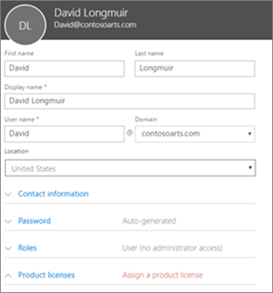
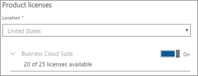

# Legg til flere brukere

Denne artikkelen gjelder for Microsoft 365 Business Premium.

## Legge til nye brukere

Se en kort video om hvordan du legger til en bruker.   

> [!VIDEO https://www.microsoft.com/videoplayer/embed/RE1FOfN] 

Hvis du synes at denne videoen er nyttig, kan du se den [fullstendige opplæringsserien for små bedrifter og de som er nybegynnere i Microsoft 365](https://support.office.com/article/6ab4bbcd-79cf-4000-a0bd-d42ce4d12816).

Slik legger du til en bruker:

1. Gå til administrasjonssenteret på <a href="https://go.microsoft.com/fwlink/p/?linkid=837890" target="_blank">https://admin.microsoft.com</a> . 
2. Velg **Brukere** aktive brukere i navigasjonsruten til \> **Active users**venstre.
3. Velg **Legg til en bruker**på Aktive **brukere-siden.**
4. Skriv inn den nødvendige informasjonen i **Ny bruker-panelet.** 
  
    Du kan angi mer informasjon under **Kontaktinformasjon**, velge hvordan du angir passordet under **Passord-innstillingen,** og tilordne roller under **Roller**.
      
    
      
    I delen Produktlisenser setter du microsoft **365 Business Premium-produktlisensinnstillingen** til **På**.
      
    
  
Hvis du vil ha mer informasjon om hvordan du legger til brukere, kan du se [Legge til brukere individuelt eller i bulk](https://docs.microsoft.com/office365/admin/add-users/add-users).
  
