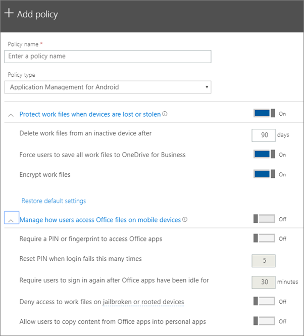

# Angi innstillinger for appbeskyttelse, for Android- eller iOS-enheter

## Opprette en policy for appbehandling

1. Gå til administrasjonssenteret <a href="https://go.microsoft.com/fwlink/p/?linkid=837890" target="_blank">https://admin.microsoft.com</a>på . 
    
2. Velg Legg **til** \> **enhetspolicyer** \> i venstre navigasjonsenhet. **Devices**
  
3. Angi et unikt navn for denne policyen på **Legg til policy**-ruten. 
    
4. Under **Policytype**velger du **Programbehandling for Android** eller **Programbehandling for iOS**, avhengig av hvilket sett med policyer du vil opprette. 
    
5. Utvid **Beskytt arbeidsfiler når enheter går tapt eller blir stjålet,** og **Administrer hvordan brukere får tilgang til Office-filer på mobile enheter**. Konfigurer innstillingene slik du ønsker. **Administrer hvordan brukere får tilgang til Office-filer på mobile enheter,** er **Av** som standard, men vi anbefaler at du slår den **på** og godtar standardverdiene. Hvis du vil ha mer informasjon, kan du se [Tilgjengelige innstillinger](#available-settings). 
    
    Du kan til enhver tid bruke **Tilbakestill standardinnstillinger**-koblingen for å gå tilbake til standardinnstillingen. 
    
    
  
6. Bestem deretter **Hvem får disse innstillingene?** Hvis du ikke vil bruke standard **sikkerhetsgruppe for alle brukere,** velger du \> **Endre**, velger sikkerhetsgruppene som får disse innstillingene **Velg**.
    
7. Velg til slutt **Ferdig** for å lagre policyen og tilordne den til enhetene. 
    
## Endre en policy for appbehandling

1. Velg Rediger policy **på** **Policyer-kortet.**
    
2. Velg policyen du vil endre, på **Rediger policy**-ruten 
    
3. Velg **Rediger** ved siden av hver innstilling for å endre verdiene i policyen. Når du endrer en verdi, lagres den automatisk i policyen.
    
4. Når du er ferdig, lukker du **rediger policyruten.** 
    
## Slette en policy for appbehandling

1. Velg en policy på **Policyer-siden,** og **slett**deretter .
    
2. Velg **Bekreft** i **slett-policyruten** for å slette policyen eller policyene du valgte. 
    
## Tilgjengelige innstillinger

Tabellene nedenfor gir detaljert informasjon om innstillinger som er tilgjengelige for å beskytte arbeidsfiler på enheter og innstillingene som styrer hvordan brukere får tilgang til Office-filer fra mobile enheter.
  
 Hvis du vil ha mer informasjon, kan du se [Hvordan beskyttelsesfunksjoner i Microsoft 365 Business Premium-kart til Intune-innstillinger](map-protection-features-to-intune-settings.md). 
  
### Innstillinger som beskytter arbeidsfiler

Følgende innstillinger er tilgjengelig for å beskytte arbeidsfiler hvis en brukers enhet mistes eller blir stjålet:
  
|||
|:-----|:-----|
|Innstilling    |Beskrivelse    |
|Slette arbeidsfiler fra en inaktiv enhet etter et visst antall dager    |Hvis en enhet ikke brukes i antall dager du angir her, slettes alle arbeidsfiler som er lagret på enheten automatisk.    |
|Tvinge brukere til å lagre alle arbeidsfiler til OneDrive for Business    |Hvis denne innstillingen er **På**, er den eneste tilgjengelige lagringsplasseringen for arbeidsfiler OneDrive for Bedrifter.    |
|Kryptere arbeidsfiler    |Behold denne innstillingen **På** slik at arbeidsfiler er beskyttet ved hjelp av kryptering. Selv om enheten går tapt eller blir stjålet, kan ingen lese firmadataene dine.    |
   
### Innstillinger som kontrollerer hvordan brukere får tilgang til Office-filer på mobile enheter

Følgende innstillinger er tilgjengelig for å styre hvordan brukere får tilgang til Office-arbeidsfiler:
  
|||
|:-----|:-----|
|Innstilling    |Beskrivelse    |
|Kreve en PIN-kode eller et fingeravtrykk for å få tilgang til Office-apper    |Hvis denne innstillingen er **Brukere** må oppgi en annen form for godkjenning, i tillegg til brukernavn og passord, før de kan bruke Office-apper på sine mobile enheter.  |
|Tilbakestille PIN-kode når påloggingen mislykkes et visst antall ganger    |Hvis du vil forhindre at en uautorisert bruker tilfeldig gjetter en PIN-kode, tilbakestilles PIN-koden etter det antallet feiloppføringer du angir.    |
|Kreve at brukere logger seg på igjen etter at Office-apper har vært inaktive i    |Denne innstillingen bestemmer hvor lenge en bruker kan være inaktiv før de blir bedt om å logge på på nytt.    |
|Avslå tilgang til arbeidsfiler på enheter der programvarebegrensningene er fjernet, eller enheter som har blitt utsatt for utiltenkt rottilgang    |Smarte brukere har kanskje en enhet der programvarebegrensningene er fjernet, eller en enhet som har blitt utsatt for utiltenkt rottilgang. Dette betyr at brukeren kan endre operativsystemet, noe som kan gjøre enheten mer utsatt for skadelig programvare. Disse enhetene blokkeres når denne innstillingen er **På**.    |
|Ikke la brukere kopiere innhold fra Office-apper til personlige apper    |Vi tillater dette som standard, men hvis innstillingen er satt til **På**, vil brukeren kunne kopiere informasjon fra en arbeidsfil til en personlig fil. Hvis innstillingen er **Av**, kan ikke brukeren kopiere informasjon fra en jobbkonto til en personlig app eller personlig konto.    |
