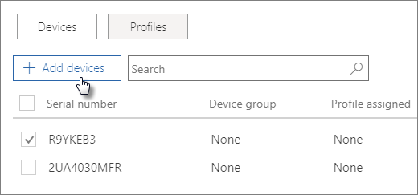

# Opprette og redigere AutoPilot-enheter

## Laste opp en liste over enheter

Du kan bruke trinnvis veiledning til å laste opp enheter, men du kan også laste opp enheter på [Enheter-fanen.](add-autopilot-devices-and-profile.md)  
  
Enheter må oppfylle disse kravene:
  
- Windows 10, versjon 1703 eller nyere
    
- Nye enheter som ikke har vært gjennom Windows-opplevelsen

1. Velg Enheter  \> **AutoPilot** i administrasjonssenteret for Microsoft 365.
  
2. Velg **Enheter-fanen** Legg til enheter på **AutoPilot-siden.** \> 
    
    
  
3. Bla til **en CSV-fil** med enhetsliste som du forberedte Lagre lukk på panelet Legg  \> **til** \> **enheter.**
    
    Du kan få denne informasjonen fra maskinvareleverandøren, eller du kan bruke [Get-WindowsAutoPilotInfo PowerShell-skriptet](https://www.powershellgallery.com/packages/Get-WindowsAutoPilotInfo) til å generere en CSV-fil. 
    
## Legge til en profil gjelder for en enhet eller en gruppe enheter

1. Velg **Enheter-fanen** på  Klargjør Windows-siden, og merk av for én eller flere enheter. 
    
2. Velg en profil fra rullegardinlisten **Tilordnet profil** på panelet **Enhet**. 
    
    Se [Opprette og redigere AutoPilot-profiler](create-and-edit-autopilot-profiles.md) for instruksjoner hvis du ikke har noen profiler ennå. 
