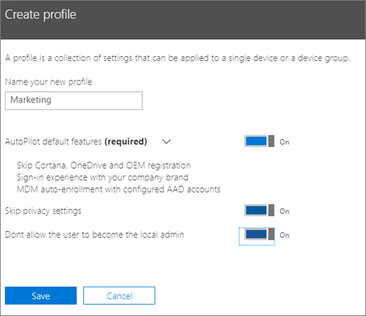
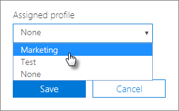

# Opprette og redigere AutoPilot-profiler

## Opprette en profil

En profil gjelder for en enhet eller en gruppe enheter.
  
1. Velg **Enheter** \> **AutoPilot**i administrasjonssenteret for Microsoft 365 .
  
2. Velg **profiler-fanen** Opprett profil på **AutoPilot-siden.** \> **Create profile**
    
3. Skriv inn et navn på profilen som hjelper deg med å identifisere den, for eksempel Markedsføring, på **Opprett profil-siden.** Slå på innstillingen du vil bruke, og velg deretter **Lagre**. Hvis du vil ha mer informasjon om AutoPilot-profilinnstillinger, kan du se [Om innstillinger for AutoPilot-profil](autopilot-profile-settings.md).
    
    
  
### Knytte profilen til en enhet

Når du har opprettet en profil, kan du bruke den på en enhet eller en gruppe enheter. Du kan velge en eksisterende profil i den [trinnvise veiledningen](add-autopilot-devices-and-profile.md) og bruke den på nye enheter, eller erstatte en eksisterende profil for en enhet eller gruppe enheter. 
  
1. Velg **Enheter**-fanen på siden **Klargjøre Windows**. 
    
2. Merk av for et enhetsnavn, og velg en profil fra rullegardinlisten **Tilordnet profil** i **Enhet-panelet.** \> **Save**
    
    
  
## Redigere, slette eller fjerne en profil

Når du har tilordnet en profil til en enhet, kan du oppdatere den, selv om du allerede har gitt enheten til en bruker. Når enheten er koblet til Internett, laster den ned den siste versjonen av profilen din under installasjonsprosessen. Hvis brukeren gjenoppretter enheten til fabrikkinnstillinger, vil enheten på nytt laste ned de siste oppdateringene til profilen din. 
  
### Redigere en profil

1. Velg **Profiler**-fanen på siden **Klargjøre Windows**. 
    
2. Merk av i avmerkingsboksen ved siden av et enhetsnavn, og oppdater alle tilgjengelige innstillinger Lagre i **Profil-panelet.** \> **Save**
    
    Hvis du gjør dette før en bruker kobler enheten til Internett, blir profilen brukt i installasjonsprosessen.
    
### Slette en profil

1. Velg **Profiler**-fanen på siden **Klargjøre Windows**. 
    
2. Merk av for et enhetsnavn, og velg **Slett profillagre** i **Profil-panelet.** \> **Save**
    
    Når du sletter en profil, blir den fjernet fra en enhet eller en gruppe enheter som den har blitt tilordnet.
    
### Fjerne en profil

1. Velg **Enheter**-fanen på siden **Klargjøre Windows**. 
    
2. Merk av for et enhetsnavn, og velg **Ingen** fra rullegardinlisten **Tilordnet profil** i **Enhet-panelet.** \> **Save**
    
