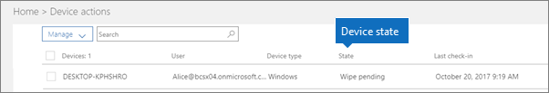

# EnhetstilstanderDevice states

Enheter i **Enhetshandlinger**-listen (hjemmesiden for administratorer \> **Enhetshandling**) kan ha følgende statuser.Devices in the **Device actions** list (Admin home \> **Device actions**) can have the following states.
  

  
|**Status****Status**|**Beskrivelse****Description**|
|:-----|:-----|
|Administrert av IntuneManaged by Intune    |Administrert av Microsoft 365 Business Premium.Managed by Microsoft 365 Business Premium.    |
|Ventende tilbaketrekkingRetire pending    |Microsoft 365 Business Premium gjør seg klar til å fjerne firmadata fra enheten.Microsoft 365 Business Premium is getting ready to remove company data from the device.    |
|Tilbaketrekking pågårRetire in progress    |Microsoft 365 Business Premium fjerner for øyeblikket firmadata fra enheten.Microsoft 365 Business Premium is currently removing company data from the device.    |
|Tilbaketrekking mislyktesRetire failed    | Fjerning av firmadata mislyktes.Remove company data action failed.    |
|Tilbakefør avsagtRetire canceled    |Pensjonisthandlingen ble avbrutt.Retire action was canceled.    |
|Ventende tømmingWipe pending    |Venter på at tilbakestilling til fabrikkinnstillinger skal starte.Waiting for factory reset to start.    |
|Tømming pågårWipe in progress    |Tilbakestilling til fabrikkinnstillinger er startet.Factory reset has been issued.    |
|Tømming mislyktesWipe failed    |Kunne ikke tilbakestille fabrikkinnstillingene.Couldn't do factory reset.    |
|Tørk avbruttWipe canceled    |Fabrikkslettingen ble kansellert.Factory wipe was canceled.    |
|UgyldigUnhealthy    |En handling venter (eller pågår), men enheten har ikke sjekket inn på 30 + dager.An action is pending (or in progress), but the device hasn't checked in for 30+ days.    |
|Sletting venterDelete pending    |Slettehandling pågår.Delete action is pending.    |
|OppdagetDiscovered    |Microsoft 365 Business Premium har oppdaget enheten.Microsoft 365 Business Premium has detected the device.    |
   
