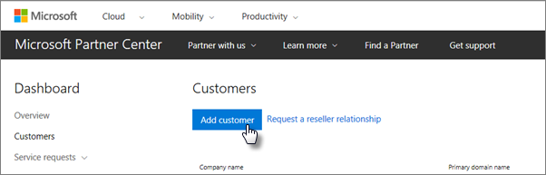
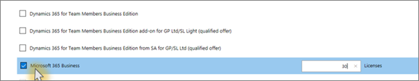

# Skaff deg Microsoft 365 Business PremiumGet Microsoft 365 Business Premium

## Få Microsoft 365 Business Premium fra MicrosoftGet Microsoft 365 Business Premium from Microsoft

Hvis du ikke har en partner og ønsker å få Microsoft 365 Business Premium, kan du [kjøpe den her](https://www.microsoft.com/en-US/microsoft-365/business).If you don't have a partner and want to get Microsoft 365 Business Premium, you can [buy it here](https://www.microsoft.com/en-US/microsoft-365/business).

Se [registrer deg for Microsoft 365 Business Premium](sign-up.md) for detaljerte instruksjoner.See [sign up for Microsoft 365 Business Premium](sign-up.md) for detailed instructions.

Du kan også gå over til en [Microsoft Store](https://www.microsoft.com/en-us/store/locations/find-a-store?icid=en_US_Store_UH_FAS) for å kjøpe Microsoft 365 Business Premium og få hjelp med konfigurasjon.You can also head over to a [Microsoft Store](https://www.microsoft.com/en-us/store/locations/find-a-store?icid=en_US_Store_UH_FAS) to buy Microsoft 365 Business Premium and get setup help.
  
## Skaff deg Microsoft 365 Business Premium fra Microsoft Partner CenterGet Microsoft 365 Business Premium from Microsoft Partner Center

1. Logg deg på [Microsoft Partnersenter](https://go.microsoft.com/fwlink/p/?linkid=849910) ved hjelp av legitimasjonen du opprettet når du registrerte deg for skytjenesteleverandørprogrammet (CSP).Sign in at [Microsoft Partner Center](https://go.microsoft.com/fwlink/p/?linkid=849910) by using the credentials you created when you enrolled to the Cloud Service Provider (CSP) program. 
    
2. Velg **Kunder**på partnerinstrumentbordet, og velg deretter kunden eller legg til en ny kunde før du får Microsoft 365 Business Premium.On the Partner Dashboard, choose **Customers**, then select your customer or add a new customer before you get Microsoft 365 Business Premium.
    
    
  
3. Velg **Legg til abonnement**på kundens **Abonnement-side** , velg Alternativet Liten bedrift under Katalog, og velg deretter **Microsoft 365 Business Premium**.On the customer's **Subscription** page, select **Add subscription**, choose the Small business option under Catalog, and then choose **Microsoft 365 Business Premium**.
    
    Velg hvor mange lisenser du trenger (opptil 300).Select the number of licenses you need (up to 300). Hvis du har flere enn 300 brukere, kan du se [Microsoft 365 Enterprise](https://go.microsoft.com/fwlink/p/?linkid=862316) i stedet.If you have more than 300 users, see [Microsoft 365 Enterprise](https://go.microsoft.com/fwlink/p/?linkid=862316) instead. 
    
    
  
    Fullfør resten av trinnene for å legge til en ny kunde, inkludert bedriftsnavnet.Complete the rest of the steps for adding a new customer, including the business name.
    

