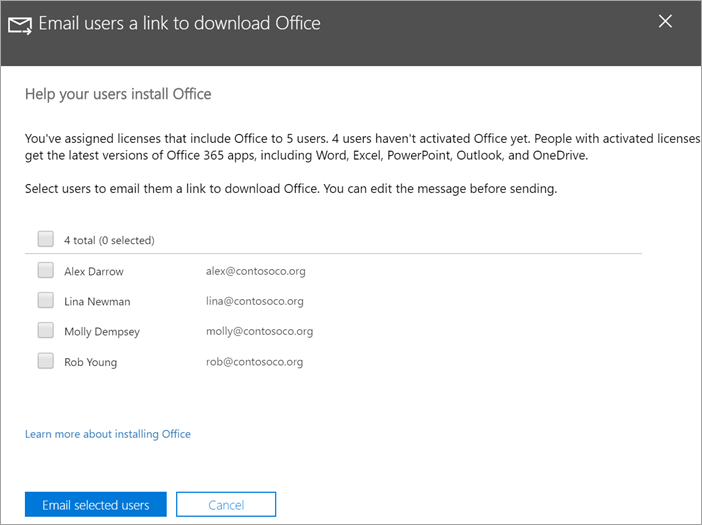

# Hjelp brukerne med å Office på Windows 10 enheterHelp your users install Office on Windows 10 devices

Du kan raskt og enkelt installere Office på Windows 10 PC-er fra Microsoft 365 administrasjonssenteret.You can quickly and easily install Office on Windows 10 PCs from the Microsoft 365 admin center.
  
Hvis du vil forstå hvordan dette fungerer med tidligere installerte Office-apper, kan du lese [Klargjøre for installasjon av Office-klienten](prepare-for-office-client-deployment.md) før du begynner.To understand how this works with previously installed Office apps, read [Prepare for Office client installation](prepare-for-office-client-deployment.md) before you get started.

Se en kort video om hvordan du installerer Office apper.Watch a short video about installing Office apps.  

> [!VIDEO https://www.microsoft.com/videoplayer/embed/acce002c-0756-4b64-ac5d-2198ee96a9b1] 

Hvis du synes at denne videoen er nyttig, kan du se den [fullstendige opplæringsserien for små bedrifter og de som er nybegynnere i Microsoft 365](../business-video/index.yml).If you found this video helpful, check out the [complete training series for small businesses and those new to Microsoft 365](../business-video/index.yml).

## Behandle Office-distribusjonerManage Office deployments

1. Gå til administrasjonssenteret på <a href="https://go.microsoft.com/fwlink/p/?linkid=2024339" target="_blank">https://admin.microsoft.com</a> , og logg på med global administratorlegitimasjon.Go to the admin center at <a href="https://go.microsoft.com/fwlink/p/?linkid=2024339" target="_blank">https://admin.microsoft.com</a>, and sign in with global admin credentials. 

2. Gå til **Oppsett** i den venstre navigasjonsruten, og **rull** til **Apper og oppdateringer** på Oppsett-siden.Go to **Setup** in the left navigation pane, and on the **Setup** page, scroll to **Apps and updates**.
    > [!NOTE]
    > Det kan hende du ikke ser dette kortet hvis alle brukerne har installert Office apper.You might not see this card if all of your  users have installed Office apps.
  
3. Velg **Vis på hjelpebrukere med å installere Office appkortet,** og deretter Kom i **gang**.On the **Help users install their Office apps** card, choose **View**, and then **Get started**.
    
4. Velg brukerne **du vil sende e-post til, og deretter Send e-post** til valgte brukere på panelet Send e-post til brukere som skal lastes ned **Office.**On the **Email users a link to download Office** panel, select the users you want to email, and then **Email selected users**.

   

## Hvis du vil ha mer informasjon om hvordan du konfigurerer og bruker Microsoft 365 Business PremiumFor more on setting up and using Microsoft 365 Business Premium

[Microsoft 365 opplæringsvideoer for bedrifterMicrosoft 365 for business training videos](../business-video/index.yml)