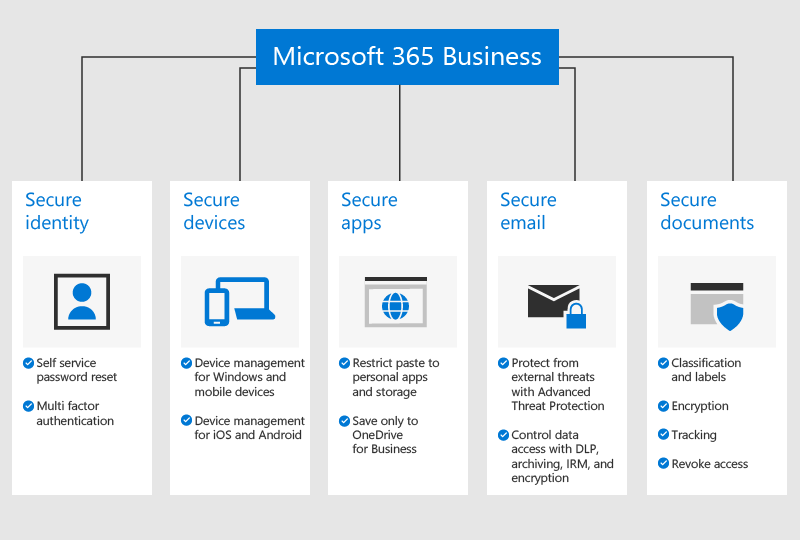

# Oversikt over Microsoft 365 Business PremiumOverview of Microsoft 365 Business Premium

## Hva er Microsoft 365 Business PremiumWhat is Microsoft 365 Business Premium

Microsoft 365 Business Premium (tidligere Microsoft 365 Business) er en omfattende abonnementstjeneste for bedrifter med færre enn 300 ansatte.Microsoft 365 Business Premium (formerly Microsoft 365 Business) is a comprehensive subscription service for businesses with less than 300 employees. Den integrerer favorittprogrammer og -tjenester for Office, og samarbeidsverktøy som Microsoft Teams, med avanserte funksjoner for sikkerhet og enhetsadministrasjon.It integrates your favorite Office productivity apps and services, and collaboration tools like Microsoft Teams, with advanced security and device management capabilities.

Se denne videoen for å få en rask oversikt over Microsoft 365 Business Premium.Watch this video for a quick overview of Microsoft 365 Business Premium.  

> [!VIDEO https://www.microsoft.com/videoplayer/embed/RE2mhaA] 
  
Hvis du synes at denne videoen er nyttig, kan du se den [fullstendige opplæringsserien for små bedrifter og de som er nybegynnere i Microsoft 365](https://support.microsoft.com/office/6ab4bbcd-79cf-4000-a0bd-d42ce4d12816).If you found this video helpful, check out the [complete training series for small businesses and those new to Microsoft 365](https://support.microsoft.com/office/6ab4bbcd-79cf-4000-a0bd-d42ce4d12816). 

Microsoft 365 Business Premium er beregnet på opptil 300 lisenser.Microsoft 365 Business Premium is meant for up to 300 licenses. Hvis du trenger flere lisenser, kan du se dokumentasjonen for [Microsoft 365 Enterprise](https://go.microsoft.com/fwlink/p/?linkid=860986) for å få mer informasjon.If you need more licenses, see [Microsoft 365 Enterprise](https://go.microsoft.com/fwlink/p/?linkid=860986) documentation for more information.

Se [tjenestebeskrivelse for Microsoft 365 Business Premium](https://docs.microsoft.com/office365/servicedescriptions/microsoft-365-service-descriptions/microsoft-365-business-service-description) for hele listen over funksjoner.See the [Microsoft 365 Business Premium service description](https://docs.microsoft.com/office365/servicedescriptions/microsoft-365-service-descriptions/microsoft-365-business-service-description) for the entire list of features.
  
## Sikkerhetsbehov for små bedrifterSmall business security needs

Dine bedriftsdata kan bli kompromittert på mange måter.Your business data can be compromised in many ways. Du og brukerne dine kan skade organisasjonens sikkerhet når du logger deg på med kompromittert legitimasjon eller ser på organisasjonsdata via forskjellige enheter og programmer.You and your users can compromise your organization's security when you sign in with compromised credentials or view organization data on different devices and applications. Mer spesifikt er organisasjonen i faresonen fra:More specifically, your organization is at risk from:

- Kompromittert eller svak påloggingslegitimasjon.Compromised or weak sign-in credentials.
- Kompromittert enhet med en svak PIN-kode, eller en brukereid enhet.Compromised device with a weak pin, or a user owned device.
- Brukere som kan kopiere og lime inn og lagre organisasjonens data til personlige apper.Users who can copy/paste/save your organization's data to personal apps.
- Brukere som installerer og bruker tredjepartsprogrammer med svak sikkerhet.Users who install and use third-party apps with weak security.
- E-postsårbarheter, inkludert deling av sensitive data, svindelforsøk, skadelig programvare og så videre.Email vulnerabilities, including sharing sensitive data, phishing attempts, malware, and so on.
- Når personer som ikke skal ha, kan få tilgang til dokumenter med sensitiv informasjon.When people who should not, can access documents with sensitive information.

Microsoft 365 Business Premium bidrar til å beskytte dataene dine i alle disse tilfellene.Microsoft 365 Business Premium helps safeguard your data in each of these instances. De følgende sikkerhetsfunksjoner som beskytter dine forretningsdata er listet i den følgende illustrasjonen.The security features that protect your business data are detailed in the following figure.

## Slik er dataene og enhetene dine beskyttetHow your data and devices are protected

Microsoft 365 Business Premium hjelper med å **forsvare mot trusler** ved å gjøre følgende:Microsoft 365 Business Premium helps **defended against threats** by:

- Skanning av koblinger i e-postmeldinger og dokumenter i sanntid for å blokkere usikre nettsteder (Klarerte koblinger).Scanning links in emails and documents in real time to block unsafe web sites (Safe Links).

- Utføring av avansert analyse av e-postvedlegg i et sandkassemiljø for å oppdage nylig utviklet skadelig programvare (Klarerte koblinger).Performing advanced analysis of email attachments in a sandbox environment to detect newly developed malware (Safe Attachments). 

- Aktivering av policyer for anti-phishing som bruker maskinlæringsmodeller og gjenkjenning av etterligning til å beskytte mot avanserte angrep (anti-phishing i Defender for Office 365-intelligens).Enabling anti-phishing policies that use machine learning models and impersonation detection to provide protection against advanced attacks (Anti-phishing in Defender for Office 365 intelligence). 

- Konfigurering av avanserte policyer som deaktiverer tilgang fra plasseringer som ikke er klarert, eller som kan gå gjennom godkjenning med flere faktorer fra klarerte plasseringer, som for eksempel Office-nettverket (Azure MFA Multi-Factor Authentification og betinget tilgang).Setting up advanced policies that disable access from untrusted locations or bypass multifactor authentication from trusted places such as your office network (Azure MFA including trusted IPs, and Conditional Access). 

- Håndhever beskyttelse mot skadelig programvare på tvers av alle Windows 10-enheter i organisasjonen og beskytter filer i viktige systemmapper fra endringer gjort av løsepengevirus (Windows Defender)Enforcing malware protection across all your organization's Windows 10 devices and protecting files in key system folders from changes made by ransomware (Windows Defender)

Dine **bedriftsdata er beskyttet** av:Your **business data is protected** by:

- Bruk av automatisk gjenkjenning til å forhindre sensitiv informasjon, for eksempel personnumre eller kredittkort fra lekkasje utenfor bedriften (hindring av datatap).Using automatic detection to help prevent sensitive information such as Social Security numbers or credit cards from leaking outside your business (data loss prevention). 

- Kryptering av sensitive e-postmeldinger, slik at du kan kommunisere på en sikker måte med kunder eller andre personer utenfor organisasjonen.Encrypting sensitive emails so you can communicate securely with customers or other people outside your organization. Dette sikrer at bare den tiltenkte mottakeren kan lese meldingen (Office 365-meldingskryptering).This ensures that only the intended recipient can read the message (Office 365 Message Encryption).

- Kontrollerer hvem som har tilgang til bedriftsinformasjon ved å bruke begrensninger, for eksempel **Ikke kopier** og **Ikke Videresend** på e-post og dokumenter (Azure Information Protection, plan 1).Controlling who has access to company information by applying restrictions such as **Do Not Copy** and **Do Not Forward** to email and documents (Azure Information Protection, Plan 1).

- Aktiverer ubegrenset skybasert arkivering slik at du kan beholde organisasjonens e-post, inkludert postbokser tilhørende tidligere ansatte (Exchange Online-arkivering).Enabling unlimited cloud archiving so you can retain all your organization's email, including the mailboxes of former employees (Exchange Online Archiving).

Dine **enheter sikres** med:Your **devices are secured** by:

- Kontroll over hvilke enheter og brukere som kan få tilgang til Microsoft-data, med alternativer for å blokkere brukere fra å logge på fra hjemmedatamaskiner, ikke-godkjente apper eller utenom arbeidstiden (Betinget tilgang).Controlling which devices and users can access your Microsoft data, with options to block users from signing in from home computers, unapproved apps, or outside of work hours (Conditional Access).

- Bruk av sikkerhetspolicyer som beskytter bedriftsdata på iOS- og Android-enheter.Applying security policies to protect business data on iOS and Android devices. Du kan for eksempel kreve at brukerne oppgir en PIN-kode eller et fingeravtrykk for å få tilgang til bedriftsdata, og kryptere data på mobile enheter (Programbeskyttelse for Office-Mobilapper).For example, you can require users to provide a PIN or fingerprint to access business data, and encrypt data on mobile devices (App protection for Office mobile apps).

- Å holde bedriftsdokumenter, e-postmeldinger og andre data innenfor godkjente Office-Mobilapper, og hindre at ansatte lagrer disse i uautoriserte apper og plasseringer (Programbeskyttelse for Office-Mobilapper).Keeping business documents, emails, and other data within approved Office mobile apps and preventing employees from saving these to unauthorized apps and locations (App protection for Office mobile apps).

- Sletting av forretningsdata eksternt fra tapte eller stjålne enheter uten at det påvirker personlig informasjon (Intune selektiv sletting).Remotely wiping business data from lost or stolen devices without affecting personal information (Intune selective wipe).

- Bruk av enkle kontroller til å administrere policyer for alle Windows 10-PC-er i bedriften, som bruker BitLocker-kryptering og automatisk installerer kritiske Windows-oppdateringer (Fremtvunget Windows-update policyer).Using simplified controls to manage policies for all the Windows 10 PCs in your company, enforcing BitLocker encryption and automatically installing critical Windows updates (Enforce Windows update policies).

Hvis du vil se en fullstendig liste over sikkerhetsfunksjoner, kan du se [Microsoft 365 Business Premium Security-funksjoner](security-features.md).To see the full list of security features, see [Microsoft 365 Business Premium security features](security-features.md). Når du har [Konfigurert Microsoft 365 Business Premium](set-up.md), kan du se [øke trusselbeskyttelsen](increase-threat-protection.md) og [konfigurere samsvarsfunksjoner](set-up-compliance.md) for å komme i gang med sikkerhetsfunksjoner som ikke er inkludert som en del av den styrte konfigurasjonen.After you [Set up Microsoft 365 Business Premium](set-up.md), see [increase threat protection](increase-threat-protection.md) and [set up compliance features](set-up-compliance.md) to get started with the security features that aren't included as a part of the guided setup. Les også [De 10 beste metodene for å sikre Office 365- og Microsoft 365 Business Premium-abonnementer](https://docs.microsoft.com/office365/admin/security-and-compliance/secure-your-business-data) for en god oversikt over hvordan du setter opp beskyttelse mot nettkriminelle og hackere.Read also [Top 10 ways to secure Office 365 and Microsoft 365 Business Premium plans](https://docs.microsoft.com/office365/admin/security-and-compliance/secure-your-business-data) for a good overview on how to set up protections against cyber criminals and hackers.

## Skaff deg Microsoft 365 Business PremiumGet Microsoft 365 Business Premium

- Hvis du har en partner, vil de få Microsoft 365 Business Premium: [Skaff deg Microsoft 365 Business Premium fra Microsoft Partnersenter](get-microsoft-365-business.md).If you have a partner, they'll get Microsoft 365 Business Premium: [Get Microsoft 365 Business Premium from Microsoft Partner Center](get-microsoft-365-business.md).

- Hvis du ikke har en partner og ønsker å få Microsoft 365 Business Premium, kan du [kjøpe den her](https://www.microsoft.com/microsoft-365/business) og følge [registrerings](sign-up.md)-instruksjonene.If you don't have a partner and want to get Microsoft 365 Business Premium, you can [buy it here](https://www.microsoft.com/microsoft-365/business) and follow the [sign up](sign-up.md) instructions.

## Se ogsåSee also

[Opplæringsvideoer for Microsoft 365 Business PremiumMicrosoft 365 Business Premium training videos](https://support.microsoft.com/office/6ab4bbcd-79cf-4000-a0bd-d42ce4d12816)
