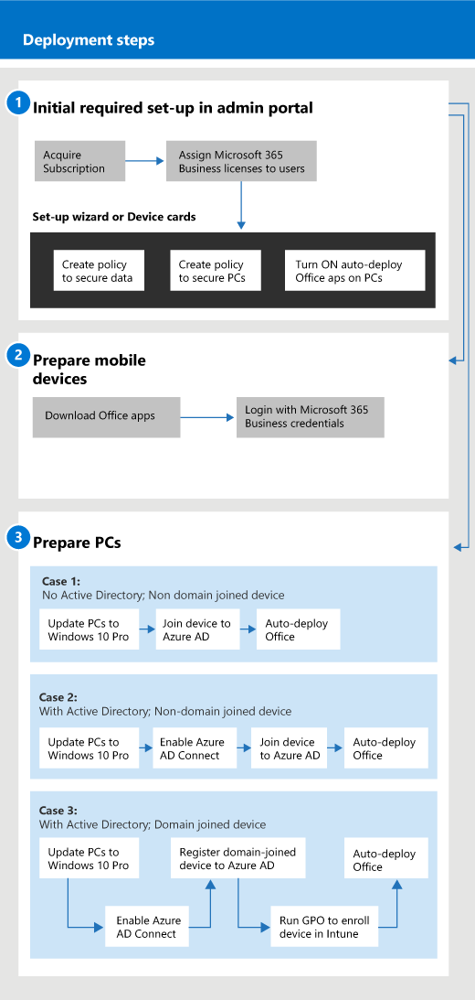

# Komme i gang med Microsoft 365 for bedrifter

## Hva er Microsoft 365 for bedrifter

Microsoft 365 for bedrifter er et omfattende sett med forretningsproduktivitets- og samarbeidsverktøy, for eksempel Outlook, Word, Excel og andre Office-produkter, som alltid er oppdatert. Du kan beskytte arbeidsfilene dine på alle iOS-, Android- og Windows 10-enhetene dine med sikkerhet i bedriftsklasse som er enkel å administrere.

Se denne videoen for en rask oversikt over Microsoft 365 for bedrifter.  

> [!VIDEO https://www.microsoft.com/videoplayer/embed/RE2mhaA] 
  
Microsoft 365 for bedrifter er ment for opptil 300 lisenser. Hvis du trenger flere lisenser, kan du se dokumentasjonen for [Microsoft 365 Enterprise](https://go.microsoft.com/fwlink/p/?linkid=860986) for å få mer informasjon. 
  
## Skaff deg Microsoft 365 for bedrifter

- Hvis du har en partner, får de Microsoft 365 for bedrifter: [Få Microsoft 365 for bedrifter fra Microsoft Partner Center](get-microsoft-365-business.md).
    
- Hvis du ikke har en partner og ønsker å få Microsoft 365 for bedrifter, kan du [kjøpe den her](https://www.microsoft.com/microsoft-365/business).
    
## Konfigurere Microsoft 365 for bedrifter

 **Oversikt over Microsoft 365 for business Suite konfigurert**
  
Diagrammet nedenfor beskriver hvordan administratorer konfigurerer Microsoft 365 for bedrifter. Den beskriver også fremgangsmåten for å klargjøre Windows-PCer for Microsoft 365 for bedrifter. Du kan også legge til nye enheter i administrasjonssenteret for Microsoft 365 med [Windows AutoPilot](add-autopilot-devices-and-profile.md). Du kan bruke AutoPilot til å konfigurere og forhåndskonfigurere nye enheter slik at de er klare for produktiv bruk så snart en bruker logger på med legitimasjonen for Microsoft 365 for bedrifter.
  

Se denne videoen for å få en oversikt over Microsoft 365 for bedrifter.  

> [!VIDEO https://www.microsoft.com/videoplayer/embed/RE1FYSM] 

Hvis du synes at denne videoen er nyttig, kan du se den [fullstendige opplæringsserien for små bedrifter og de som er nybegynnere i Microsoft 365](https://support.microsoft.com/office/6ab4bbcd-79cf-4000-a0bd-d42ce4d12816).

  
### 1: Konfigurere Microsoft 365 for bedrifter (Admin)

Logg på [administrasjonssenteret for Microsoft 365](https://portal.office.com/adminportal/home) med den globale administratorlegitimasjonen, og fullfør følgende trinn for å konfigurere Microsoft 365 for bedrifter. 
  
1. [Forutsetninger for å beskytte data på enheter med Microsoft 365 for bedrifter](pre-requisites-for-data-protection.md)
    
    Les først forutsetningene for å forsikre deg om at enhetene er klare for Microsoft 365 for bedrifter.
    
2. [Bruke installasjonsveiviseren til å konfigurere Microsoft 365 for bedrifter](set-up.md)
    
    Hvis du **flytter fra en lokal Active Directory permanent til skyen,** kan du gå til administrasjonssenteret for Microsoft 365 og bruke installasjonsveiviseren til å legge til brukerne manuelt, eller du kan synkronisere én gang med Azure AD Connect. Dette kan gjøres på to måter: 
    
    - Hvis du også har en Exchange-2010-, Exchange-2013- eller Exchange-2016-server, kan du [bruke Minimal Hybrid til raskt å overføre Exchange-postbokser til Microsoft 365](https://docs.microsoft.com/Exchange/mailbox-migration/use-minimal-hybrid-to-quickly-migrate). De minimale hybridtrinnene inkluderer en engangssynkronisering av brukere til Azure AD og e-postoverføring fra lokale til skyen. Når e-postoverføringen er fullført, deaktiveres katalogsynkronisering automatisk når du bruker denne metoden.
    
    - Bruk veiviseren for katalogsynkronisering til å synkronisere brukerne til skyen. Følg trinnene i [Konfigurere katalogsynkronisering for Microsoft 365](https://docs.microsoft.com/office365/enterprise/set-up-directory-synchronization) for å fullføre denne prosessen. Når du synkroniserer brukerne til skyen, må du [deaktivere katalogsynkronisering for Microsoft 365](https://docs.microsoft.com/office365/enterprise/turn-off-directory-synchronization).
    
    Du må også gi hver bruker som ble lagt til på denne måten en lisens til Microsoft 365 for bedrifter. Du kan gjøre dette i [installasjonsveiviseren,](set-up.md) eller du kan [tilordne lisenser til brukere](../admin/manage/assign-licenses-to-users.md).
    
### 2: Klargjøre mobile enheter

Følg trinnene i [Konfigurere mobile enheter for Brukere av Microsoft 365 for bedrifter](set-up-mobile-devices.md) til å installere Office-apper på enheter og kontrollere at de er beskyttet av Microsoft 365 for bedrifter. 
  
### 3: Klargjøre PCer

Administratorer kan forhåndsvelge innstillinger for nye Windows 10-PCer ved hjelp av [Windows AutoPilot](add-autopilot-devices-and-profile.md). Brukere kan konfigurere eksisterende eller nye Windows 10-enheter ved å følge trinnene i dette emnet: [Konfigurere Windows-PCer for Microsoft 365 for forretningsbrukere](set-up-windows-devices.md). For eksisterende enheter kan brukere **eventuelt** [flytte filer til OneDrive for Business](move-files-to-onedrive.md). De kan også bruke tredjepartsverktøy til å flytte filer som er knyttet til Windows-profil, til OneDrive.
  
Hvis organisasjonen bruker lokal Windows Server Active Directory, kan du konfigurere Microsoft 365 for bedrifter til å beskytte Windows 10-enhetene dine, samtidig som du opprettholder tilgangen til lokale ressurser som krever lokal godkjenning. Følg trinnene i [Aktiver domenet som er sammenkoblet til Windows 10-enheter som skal administreres av Microsoft 365 for bedrifter for](manage-windows-devices.md) å konfigurere dette. Denne metoden foretrekkes, og enheter i denne tilstanden kalles **Hybrid Azure AD sammenføyde enheter**. 
  
Hvis du beholder en lokal Active Directory som inneholder noen lokale ressurser (for eksempel delte filressurser og skrivere), kan du gi **Azure AD-tilkoblede enheter** tilgang til disse ressursene ved å følge fremgangsmåten her: [Få tilgang til lokale ressurser fra en Azure AD-tilknyttet enhet i Microsoft 365 for bedrifter](access-resources.md).
  
  
## Kontakt kundestøtte

 **Hvis du må ta kontakt med kundestøtte:**
  
- Kontakt partneren din.
    
- Som Microsoft 365 for business-administrator har du tilgang til kundestøtteteamet vårt: ** [Kontakt kundestøtte for forretningsprodukter - Admin Hjelp](https://docs.microsoft.com/microsoft-365/admin/contact-support-for-business-products)**
    
## Se også

[Dokumentasjon og ressurser for Microsoft 365 for bedrifter](https://go.microsoft.com/fwlink/p/?linkid=853701)
  
[Administrere Microsoft 365 for bedrifter](manage.md)[migrere til Microsoft 365 for bedrifter](migrate-to-microsoft-365-business.md)

[Opplæringsvideoer for Microsoft 365 for bedrifter](https://support.microsoft.com/office/6ab4bbcd-79cf-4000-a0bd-d42ce4d12816) 
