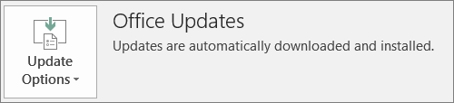

# Klargjøre for distribusjon av Office-klient av Microsoft 365 for bedrifter

## Klargjøre for å installere Office-programmer automatisk på klientmaskiner

Du kan bruke Microsoft 365 for bedrifter til å installere 32-biters Office-apper automatisk på Windows 10-datamaskiner og holde dem oppdatert med oppdateringer.
  
Automatisk installasjon fungerer best hvis sluttbrukerens datamaskin er på Windows 10 Business og:
  
- Ikke har eksisterende Office-skrivebordsapper (Word, Excel, PowerPoint, Outlook, OneNote, Publisher, Access og OneDrive).
    
    eller
    
- Har en eksisterende versjon av Klikk og bruk Office installert.
    
Hvis du vil finne ut om du har klikk og bruk-versjonen av Office, gå til **Fil** \> **Konto** i en hvilken som helst Office-app ( **Office Konto** i Outlook). Hvis du **ser Office-oppdateringer** som vist i figuren nedenfor, ble installasjonen gjort ved hjelp av Klikk og bruk. 
  

  
 **Hvem drar nytte av å ha denne funksjonen**
  
Sluttbruker med PC som:
  
- **Har** en Windows 10 Business-brukerlisens, en aktiv Microsoft 365 for business-lisens, Windows 10 Creators Update og er koblet til Azure Active Directory. 
    
- **Har ikke** 64-biters Office-apper (f.eks. Word, Excel, PowerPoint). Hvis 64-biters Office-apper er nødvendig, er ikke denne funksjonen god passform fordi det ikke finnes noen støtte for å utløse en 64-biters 2016 Klikk og bruk-versjon av Office fra Microsoft 365 for business admin-konsollen. 
    
- **Ikke har** noen frittstående apper for 2016 Windows Installer (MSI) (for eksempel Visio eller Project). Microsoft 365 for bedrifter oppgraderer Office til Klikk og trykk-til-kjøre-versjonen av Office-2016, og som ikke fungerer med frittstående apper for Office-2016 MSI. 
    
Tabellen nedenfor viser hvilken handling sluttbrukerne/administratorene kanskje må utføre, avhengig av starttilstanden, for å ha en vellykket 32-biters Klikk og bruk-versjon av Office-distribusjon fra Microsoft 365 for business admin-konsollen.
  
|**Status for Office-installasjon før start**|**Handling som skal iverksettes før Microsoft 365 for business Office-installasjon**|**Sluttstatus**|
|:-----|:-----|:-----|
|Ingen Office suite installert    |Ingen    |Office 2016 32-biters installeres ved hjelp av Klikk og bruk    |
|Eksisterende 32-biters Klikk og bruk-versjon av Office (2016 eller tidligere), og ingen frittstående apper    |Ingen    |Oppgradert til den nyeste 32-biters Klikk og bruk-versjonen av Office 2016, etter behov **\***   |
|Eksisterende Klikk og bruk 32-biters versjon av Office og Klikk og bruk 32-biters eller 64-biters frittstående Office-apper (for eksempel Visio, Project)    |Ingen    |Frittstående apper påvirkes ikke. Programserien er oppgradert til 32-biters Klikk og bruk-versjon av Office 2016    |
|Eksisterende 32-biters Klikk og bruk-versjon av Office og eventuelle 32- eller 64-biters (unntatt 2016) MSI frittstående Office-apper    |Ingen    |Frittstående apper påvirkes ikke. Programserien er oppgradert til 32-biters Klikk og bruk-versjon av Office 2016    ||||
|En hvilken som helst eksisterende 64-biters Klikk og bruk-versjon av Office    |Avinstaller 64-biters Office-apper hvis det er ok å erstatte dem med 32-biters Office-apper    |Hvis Office 64-biters apper blir fjernet, installeres 32-biters Klikk og bruk-versjonen av Office 2016    |
|En eksisterende MSI-installasjon av Office 2016 med eller uten frittstående apper    |Avinstallere MSI Office 2016.    |32-biters versjon av Klikk og bruk av Office 2016 er installert. Ingen endring i frittstående apper    |
|Eksisterende MSI-installasjon av Office 2013 (eller tidligere) og/eller frittstående Office-apper    |Ingen    |32-biters Klikk og bruk-versjonen av Office 2016 med den eksisterende MSI Office-installasjonen (og frittstående apper) finnes side ved side    |
||||
   
 **(\*) Obs:** Oppgrader ikke til 32-biters Klikk og bruk-versjonen av Office 2016 på grunn av en kjent feil. En løsning pågår. 
  
