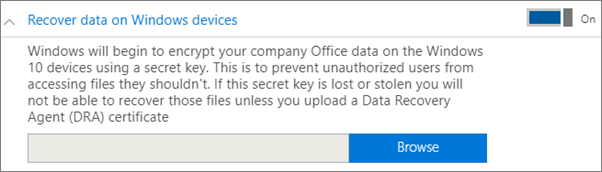
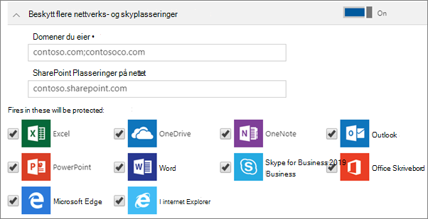

# Angi eller redigere innstillinger for program beskyttelse for Windows 10-enheter

Denne artikkelen gjelder for Microsoft 365 Business Premium.

## Redigere en policy for app-behandling for Windows 10

1. Gå til administrasjons senteret på <a href="https://go.microsoft.com/fwlink/p/?linkid=837890" target="_blank">https://admin.microsoft.com</a> .     
2. Velg **enhets** policyer i det venstre navigasjons feltet \> **Policies** .
1. Velg en eksisterende policy for Windows-apper, og **Rediger**deretter.
1. Velg **Rediger** ved siden av en innstilling du vil endre, og **Lagre**.

## Opprette en policy for appbehandling for Windows 10

Hvis brukerne har personlige Windows 10-enheter der de utfører arbeidsoppgaver, kan du beskytte dataene dine på disse enhetene i tillegg.
  
1. Gå til administrasjons senteret på <a href="https://go.microsoft.com/fwlink/p/?linkid=837890" target="_blank">https://admin.microsoft.com</a> . 
2. Velg **Devices** \> **Policies** \> **Legg til**enhets policyer i det venstre navigasjons feltet.
3. Angi et unikt navn for denne policyen i **Legg til Policy**-ruten. 
4. Velg **Programbehandling for Windows 10** under **Policytype**.
5. Velg enten **personlig** eller **firmaet som eies**under **enhets type**.
6. **Krypter arbeidsfiler** aktiveres automatisk. 
7. Sett **Forhindre brukere fra å kopiere bedriftsdata til personlige filer, og tvinge dem til å lagre arbeidsfiler til OneDrive for Business** til **På** hvis du ikke vil at brukerne skal lagre arbeidsfiler på PCen. 
9. Utvid **Gjenopprett data på Windows-enheter**. Vi anbefaler at du slår det **på**.
    Før du kan bla til plasseringen av Sertifikatet for datagjenopprettingsagent, må du først opprette ett. Hvis du vil ha instruksjoner, kan du se [opprette og bekrefte et EFS-sertifikat (Encrypting File System) for data gjenopprettings agent](https://go.microsoft.com/fwlink/p/?linkid=853700).
    
    Som standard blir arbeidsfiler kryptert ved hjelp av en hemmelig nøkkel som er lagret på enheten og knyttet til brukerens profil. Bare brukeren kan åpne og dekryptere filen. Men hvis en enhet mistes eller en bruker fjernes, kan en fil bli sittende fast i en kryptert tilstand. En administrator kan bruke DRA-sertifikatet (Data Recovery agent) til å dekryptere filen.
    
    
  
10. Utvid **Beskytt flere nettverk og Sky plasseringer** hvis du vil legge til flere domener eller SharePoint Online-plasseringer for å sikre at filene i alle de oppførte appene er beskyttet. Hvis du trenger å angi mer enn ett element for hvert felt, kan du bruke semikolon (;) mellom elementene.
    
    
  
11. Bestem deretter **Hvem får disse innstillingene?** Hvis du ikke vil bruke den standard sikkerhetsgruppen **Alle brukere**, velger du **Endre** og deretter sikkerhetsgruppene som vil få disse innstillingene \> **Velg**.
12. Velg til slutt **Legg til** for å lagre policyen og tilordne den til enhetene. 
