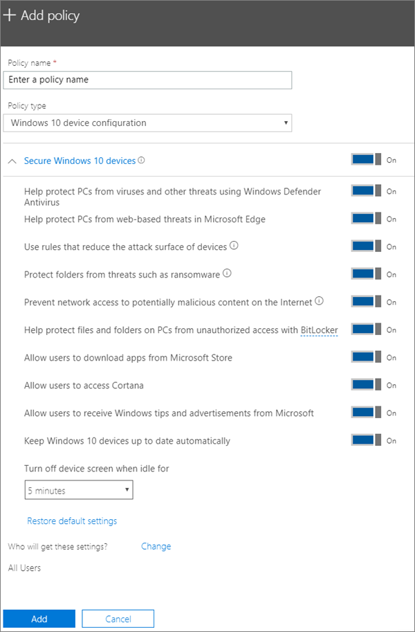

# Redigere eller opprette innstillinger for enhetsbeskyttelse for Pc-er med Windows 10Edit or create device protection settings for Windows 10 PCs

Denne artikkelen gjelder for Microsoft 365 Business Premium.This article applies to Microsoft 365 Business Premium.

Når du har konfigurert standardinnstillinger for Windows-beskyttelse på installasjonssiden, kan du legge til nye som gjelder for enten alle brukere eller et sett med brukere.After you have set set up default Windows protection settings on the Setup page, you can add new ones that apply to either all users, or a set of users. Du kan også redigere alle du har opprettet.You can also edit any of the ones you have created.

## Opprette beskyttelsesinnstillinger for Windows 10-enheterCreate protection settings for Windows 10 devices

Se en video om hvordan du sikrer Windows 10-enheter med Microsoft 365 Business Premium:View a video on how to secure Windows 10 devices with Microsoft 365 Business Premium:
  
> [!VIDEO https://www.microsoft.com/videoplayer/embed/a5734146-620a-4cec-8618-536b3ca37972?autoplay=false]
  
1. Gå til administrasjonssenteret på <a href="https://go.microsoft.com/fwlink/p/?linkid=837890" target="_blank">https://admin.microsoft.com</a> .Go to the admin center at <a href="https://go.microsoft.com/fwlink/p/?linkid=837890" target="_blank">https://admin.microsoft.com</a>. 
2. Velg Legg til  enheter \> **policyer til** \> **venstre.**On the left nav, choose **Devices** \> **Policies** \> **Add**.
3. Angi et unikt navn for denne policyen på **Legg til policy**-ruten.On the **Add policy** pane, enter a unique name for this policy. 
4. Velg **Windows 10-enhetskonfigurasjon** under **Policytype**.Under **Policy type**, choose **Windows 10 Device Configuration**.
5. Utvid **Sikre Windows 10-enheter** \> konfigurer innstillingene slik du ønsker.Expand **Secure Windows 10 Devices** \> configure the settings how you would like. Hvis du vil ha mer informasjon, kan [du se Tilgjengelige innstillinger](#available-settings).For more information, see [Available settings](#available-settings). 
    
    Du kan til enhver tid bruke **Tilbakestill standardinnstillinger**-koblingen for å gå tilbake til standardinnstillingen.You can always use the **Reset default settings** link to return to the default setting. 
    
    
  
6. Bestem deretter **Hvem får disse innstillingene?** Hvis du ikke vil bruke den standard sikkerhetsgruppen **Alle brukere**, velg **Endre**, søk etter sikkerhetsgruppen som vil få disse innstillingene \> **Velg**.Next decide **Who will get these settings?** If you don't want to use the default **All users** security group, Choose **Change**, search for the security group who will get these settings \> **Select**.
7. Velg til slutt **Ferdig** for å lagre policyen og tilordne den til enhetene.Finally, choose **Done** to save the policy, and assign it to devices. 

## Redigere beskyttelsesinnstillinger for Windows 10Edit Windows 10 protection settings
 
1. Gå til administrasjonssenteret på <a href="https://go.microsoft.com/fwlink/p/?linkid=837890" target="_blank">https://admin.microsoft.com</a> .Go to the admin center at <a href="https://go.microsoft.com/fwlink/p/?linkid=837890" target="_blank">https://admin.microsoft.com</a>.     
2. Velg Enheter policyer **til** \> **venstre.**On the left nav, choose **Devices** \> **Policies** .
1. Velg en eksisterende Windows-enhetspolicy, og velg deretter **Rediger**.Choose an existing Windows device policy and then **Edit**.
1. Velg **Rediger** ved siden av en innstilling du vil endre, og velg deretter **Lagre**.Choose **Edit** next to a setting you want to change and then **Save**.

## Tilgjengelige innstillingerAvailable settings

Som standard er alle innstillingene **På**.By default all settings are **On**. Følgende innstillinger er tilgjengelige.The following settings are available.
  
Hvis du vil ha mer informasjon, kan du se [Hvordan fungerer beskyttelsesfunksjoner i Microsoft 365 Premium-kart til Intune-innstillinger](map-protection-features-to-intune-settings.md).For more information, see [How do protection features in Microsoft 365 Premium map to Intune settings](map-protection-features-to-intune-settings.md). 
  
|||
|:-----|:-----|
|InnstillingSetting    |BeskrivelseDescription    |
|Beskytte PC mot virus og andre trusler ved hjelp av Windows Defender AntivirusHelp protect PCs from viruses and other threats using Windows Defender Antivirus    |Krever at Windows Defender Antivirus er slått på for å beskytte PC-er fra farene ved å være koblet til Internett.Requires that Windows Defender Antivirus is turned on to protect PCs from the dangers of being connected to the internet.    |
|Beskytte PC-er fra nettbaserte trusler i Microsoft EdgeHelp protect PCs from web-based threats in Microsoft Edge    |Slår på innstillinger i Microsoft Edge som beskytter brukere mot skadelige nettsteder og nedlastinger.Turns on settings in Edge that help protect users from malicious sites and downloads.    |
|Bruk regler som kan redusere angrepsoverflaten til enheteneUse rules that reduce the attack surface of devices    |Når reduksjon av angrepsoverflater er aktivert, er det med på å blokkere handlinger og apper som vanligvis brukes av skadelig programvare til å infisere enheter. Denne innstillingen er bare tilgjengelig hvis Windows Defender Antivirus er satt til På. Se [Redusere angrepsoverflater](/windows/security/threat-protection/microsoft-defender-atp/exploit-protection) for mer informasjon.  When turned On, attack surface reduction helps block actions and apps typically used by malware to infect devices. This setting is only available if Windows Defender Antivirus is set to On. See [Reduce attack surfaces](/windows/security/threat-protection/microsoft-defender-atp/exploit-protection) to learn more.    |
|Beskytte mapper mot trusler, for eksempel løsepengevirusProtect folders from threats such as ransomware    |Denne innstillingen bruker kontrollert mappetilgang til å beskytte firmadata mot endringer ved mistenkelige eller skadelige programmer, for eksempel løsepengevirus.This setting uses controlled folder access to protect company data from modification by suspicious or malicious apps, such as ransomware. Denne typen programmer hindres i å gjøre endringer i beskyttede mapper.These types of apps are blocked from making changes in protected folders. Denne innstillingen er bare tilgjengelig hvis Windows Defender Antivirus er satt til På.This setting is only available if Windows Defender Antivirus is set to On. Se [Beskytte mapper med styrt mappetilgang for](/mem/configmgr/protect/deploy-use/create-deploy-exploit-guard-policy#bkmk_CFA) å finne ut mer.See [Protect folders with Controlled folder access](/mem/configmgr/protect/deploy-use/create-deploy-exploit-guard-policy#bkmk_CFA) to learn more.    |
|Hindre nettverkstilgang til potensielt skadelig innhold på InternettPrevent network access to potentially malicious content on the Internet    |Bruk denne innstillingen til å blokkere utgående brukertilkoblinger til Internett-plasseringer med dårlig omdømme som kan være vert for phishingsvindel, -utnyttelse eller annet skadelig innhold.Use this setting to block outbound user connections to low-reputation Internet locations that may host phishing scams, exploits, or other malicious content. Denne innstillingen er bare tilgjengelig hvis Windows Defender Antivirus er satt til **På**.This setting is only available if Windows Defender Antivirus is set to **On**. Hvis du vil ha mer informasjon, [kan du se Beskytte nettverket](/windows/security/threat-protection/windows-defender-antivirus/configure-real-time-protection-windows-defender-antivirus).For more information, see [Protect your network](/windows/security/threat-protection/windows-defender-antivirus/configure-real-time-protection-windows-defender-antivirus).    |
|Bruke BitLocker til å beskytte filer og mapper på PC-er mot uautorisert tilgangHelp protect files and folders on PCs from unauthorized access with BitLocker    |BitLocker beskytter dataene ved å kryptere harddiskene på datamaskinen og beskytter mot eksponering av dataene dersom en datamaskin mistes eller blir stjålet.Bitlocker protects data by encrypting the computer hard drives and protect against data exposure if a computer is lost or stolen. Hvis du vil ha mer informasjon, kan du [se Vanlige spørsmål om Bitlocker](/windows/security/information-protection/bitlocker/bitlocker-frequently-asked-questions).For more information, see [Bitlocker FAQ](/windows/security/information-protection/bitlocker/bitlocker-frequently-asked-questions).    |
|Tillat brukere å laste ned apper fra Microsoft StoreAllow users to download apps from Microsoft Store    |Lar brukere laste ned og installere apper fra Microsoft Store. Apper inkluderer alt fra spill til produktivitetsverktøy, så vi lar denne innstillingen være **På**, men du kan slå den av for ekstra sikkerhet.  Lets users download and install apps from the Microsoft Store. Apps include everything from games to productivity tools, so we leave this setting **On**, but you can turn it off for extra security.    |
|Gi brukere tilgang til CortanaAllow users to access Cortana    |Cortana kan være svært nyttig!Cortana can be very helpful! Cortana kan aktivere eller deaktivere innstillinger for deg, gi veibeskrivelser og sørge for at du er på tide med avtaler, så vi beholder denne innstillingen På **som** standard.Cortana can turn settings on or off for you, give directions, and make sure you're on time for appointments, so we keep this setting **On** by default.    |
|Tillat brukere å motta Windows-tips og annonser fra MicrosoftAllow users to receive Windows tips and advertisements from Microsoft    |Tips for Windows kan være praktisk, samt orientere brukere når nye funksjoner utgis.Windows tips can be handy and help orient users when new features are released.    |
|Holde Windows 10-enheter oppdatert automatiskKeep Windows 10 devices up to date automatically    |Sørger for at Windows 10-enheter automatisk mottar de nyeste oppdateringene.Makes sure that Windows 10 devices automatically receive the latest updates.    |
|Slå av skjermen på enheten når den har vært inaktiv i en viss periodeTurn off device screen when idle for this amount of time    |Sørger for at bedriftsdata er beskyttet dersom en bruker er inaktiv. En bruker kan jobbe på et offentlig sted, som for eksempel en kaffebar, går bort eller blir distrahert i et øyeblikk, og lar enheten være sårbar for tilfeldig innsyn. Denne innstillingen lar deg bestemme hvor lenge en bruker kan være inaktiv før skjermen slås av.Makes sure that company data is protected if a user is idle. A user may be working in a public location, like a coffee shop, and step away or be distracted for just a moment, leaving their device vulnerable to random glances. This setting lets you control how long the user can be idle before the screen shuts off.    |