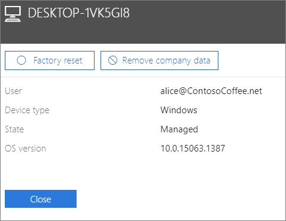

# Fjerne firmadata fra enheter

## Fjerne firmadata

Du kan bruke Microsoft 365 Business til å fjerne firmadata brukerne har på [enhetene](app-protection-settings-for-android-and-ios.md) sine eller på [Windows-PC-er](protection-settings-for-windows-10-devices.md) som er beskyttet av Microsoft 365. **Hvis du fjerner firmadata fra en enhet, kan du ikke gjenopprette dem senere**. 
  
1. Gå til administrasjonssenteret <a href="https://go.microsoft.com/fwlink/p/?linkid=837890" target="_blank">https://admin.microsoft.com</a>på .
    
2. Velg Administrasjon av **enheter** \> til **venstre.**  
  
3. Velg **** eller søk etter en bruker som vil fjerne dataene, på Administrer-siden, og velg navnet. 
    
4. Velg enheten eller enhetene fra **Enheter-listen** i den neste ruten. I enhetsruten som åpnes, kan du velge å tilbakestille enheten til fabrikkinnstillinger eller fjerne firmadata, avhengig av enhetstypen. 
    
    
  
5. Velg **Bekreft** \> **lukk**i bekreftelsesruten.
    

