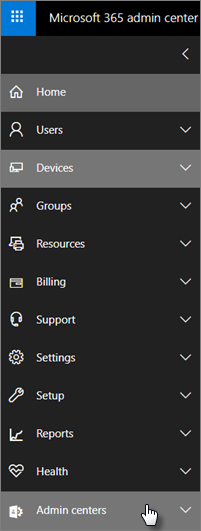

# Sikkerhets- og samsvarsfunksjoner for Microsoft 365 Business PremiumMicrosoft 365 Business Premium security and compliance features

Microsoft 365 Business Premium tilbyr forenklede sikkerhetsfunksjoner for å beskytte dataene dine på PC-er, telefoner og nettbrett.Microsoft 365 Business Premium offers simplified security features to help safeguard your data on PCs, phones, and tablets.
    
## Sikkerhetsfunksjoner i administrasjonssenteret for Microsoft 365Microsoft 365 admin center security features

Du kan administrere mange av sikkerhetsfunksjonene for Microsoft 365 Business Premium i administrasjonssenteret, noe som gir deg en forenklet måte å aktivere eller deaktivere disse funksjonene på.You can manage many of the Microsoft 365 Business Premium security features in the admin center, which gives you a simplified way to turn these features on or off. I administrasjonssenteret kan du gjøre følgende:In the admin center, you can do the following:
  
- [Angi innstillinger for programbehandling for Android- eller iOS-enheter](app-protection-settings-for-android-and-ios.md) .[Set application management settings for Android or iOS devices](app-protection-settings-for-android-and-ios.md) . 
    
    Disse innstillingene omfatter å slette filer fra en inaktiv enhet etter en angitt periode, kryptere arbeidsfiler, kreve at brukerne angir en PIN-kode og så videre.These settings include deleting files from an inactive device after a set period, encrypting work files, requiring that users set a PIN, and so on.
    
- [Angi innstillinger for programbeskyttelse for Windows 10-enheter](protection-settings-for-windows-10-devices.md) .[Set application protection settings for Windows 10 devices](protection-settings-for-windows-10-devices.md) . 
    
    Disse innstillingene kan brukes på firmadata på både firmaeide eller personlig eide enheter.These settings can be applied to company data on both company-owned, or personally owned devices.
    
- [Angi innstillinger for enhetsbeskyttelse for Windows 10-enheter](protection-settings-for-windows-10-pcs.md) .[Set device protection settings for Windows 10 devices](protection-settings-for-windows-10-pcs.md) . 
    
    Du kan aktivere [BitLocker-kryptering](/windows/security/information-protection/bitlocker/bitlocker-frequently-asked-questions) for å beskytte data i tilfelle en enhet blir mistet eller stjålet, og aktivere [Windows Exploit Guard](/windows/security/threat-protection/microsoft-defender-atp/enable-exploit-protection) for å gi avansert beskyttelse mot løsepengevirus.You can enable [BitLocker](/windows/security/information-protection/bitlocker/bitlocker-frequently-asked-questions) encryption to help protect data in case a device is lost or stolen, and enable [Windows Exploit Guard](/windows/security/threat-protection/microsoft-defender-atp/enable-exploit-protection) to provide advanced protection against ransomware. 
    
- [Fjerne firmadata fra enheterRemove company data from devices](remove-company-data.md)
    
    Du kan slette firmadata eksternt hvis en enhet går tapt, stjålet eller en ansatt forlater firmaet.You can remotely wipe company data if a device is lost, stolen, or an employee leaves your company.
    
- [Tilbakestill Windows 10-enheter til fabrikkinnstillingene.](reset-devices-to-factory-settings.md)[Reset Windows 10 devices to their factory settings](reset-devices-to-factory-settings.md) . 
    
    Du kan tilbakestille alle Windows 10-enheter som har aktivert innstillinger for enhetsbeskyttelse.You can reset any Windows 10 devices that have device protection settings applied to them.
    
## Ekstra sikkerhetsfunksjonerAdditional security features 

Avanserte funksjoner i Microsoft 365 Business Premium er tilgjengelige for å hjelpe deg med å beskytte bedriften mot cybertrusler og beskytte sensitiv informasjon.Advanced features in Microsoft 365 Business Premium are available to help you protect your business against cyber-threats and safeguard sensitive information.
  
- **[Microsoft Defender for Office 365](../security/office-365-security/defender-for-office-365.md)****[Microsoft Defender for Office 365](../security/office-365-security/defender-for-office-365.md)**
    
    Microsoft Defender for Office 365 bidrar til å beskytte bedriften mot avanserte phishing- og løsepengevirusangrep som er utformet for å kompromittere informasjon om ansatte eller kunder.Microsoft Defender for Office 365 helps guard your business against sophisticated phishing and ransomware attacks designed to compromise employee or customer information. Funksjonene omfatter:Features include:
    
  - Avansert skanning av vedlegg og AI-drevet analyse for å oppdage og forkaste farlige meldinger.Sophisticated attachment scanning and AI-powered analysis to detect and discard dangerous messages.
    
  - Automatiske kontroller av koblinger i e-post for å vurdere om de er en del av et phishing-forsøk.Automatic checks of links in email to assess if they're part of a phishing scheme. Dette holder deg trygg fra å få tilgang til usikre nettsteder.This keeps you safe from accessing unsafe websites.

- **[De fullstendige funksjonene til Intune i Azure-portalen](/mem/intune/fundamentals/what-is-intune)****[The full capabilities of Intune in the Azure portal](/mem/intune/fundamentals/what-is-intune)**
    
    Når du har tilgang til Administrasjonssenter for Intune i Azure-portalen, kan du konfigurere flere sikkerhetsfunksjoner, for eksempel administrasjon av MacOS-enheter, iPhone og Android-enheter, sammen med avansert enhetsbehandling for Windows, som ikke er tilgjengelig via administrasjonssenteret for Microsoft 365.Accessing the Intune admin center in the Azure portal allows you to set up additional security features, such as management of MacOS devices, iPhone, and Android devices, along with advanced device management for Windows, that aren't available through Microsoft 365 admin center.
- **Samme [betinget tilgang](/azure/active-directory/conditional-access/overview) som Azure AD Premium P1-plan****Same [Conditional Access](/azure/active-directory/conditional-access/overview) as Azure AD Premium P1 plan**

    Betinget tilgang kan bidra til å beskytte organisasjonen mot påloggingsrisiko, tilgangsforsøk fra et uventet nettverk eller nasjonalt område, tilgangsforsøk fra risikofylte enhetstyper og så videre.Conditional Access can help protect your organization from sign-in risk, access attempts from an unexpected network or locale, access attempts from risky device types, and so on. Policyer for betinget tilgang håndheves etter at den første godkjenningen er fullført, og den bruker signaler fra den første godkjenningshendelsen til å avgjøre om den forsøkte tilgangen skal godkjennes, avslås eller om det kreves flere bevis (for eksempel en annen form for identifikasjon).Conditional Access policies are enforced after the first authentication is completed, and it uses signals from the first authentication event to determine if the attempted access should be approved, denied, or if more proof (such as a second form of identification) is required.

    Funksjonene for betinget tilgang som er inkludert, er:The conditional access features included are:

    - Tilgang basert på brukernavn, gruppe og rolleAccess based on username, group, and role
    - Access [basert på en app](/azure/active-directory/conditional-access/app-based-conditional-access)Access [based on an app](/azure/active-directory/conditional-access/app-based-conditional-access) 
    - [Tilgang basert på plassering](/azure/active-directory/authentication/howto-registration-mfa-sspr-combined#conditional-access-policies-for-combined-registration);  bare tillate tilgang fra klarerte IP-områder eller bestemte land[Access based on location](/azure/active-directory/authentication/howto-registration-mfa-sspr-combined#conditional-access-policies-for-combined-registration);  only allow access from trusted IP ranges or specific countries 
    - Krev MFA for tilgangRequire MFA for access
    - Blokkere tilgang til apper som bruker [eldre godkjenning](/azure/active-directory/conditional-access/block-legacy-authentication)Block access to apps that use [legacy authentication](/azure/active-directory/conditional-access/block-legacy-authentication)
    - Krev apper for å bruke [Intune-appbeskyttelse](/azure/active-directory/conditional-access/app-protection-based-conditional-access)Require apps to use [Intune app protection](/azure/active-directory/conditional-access/app-protection-based-conditional-access)
    - Egendefinert godkjenning, for eksempel MFA med tredjepartsleverandører, for eksempel DUO.Custom authentication such as MFA with third-party providers, for example DUO.
   
    Andre funksjoner:Other features:
    - [Selvbetjent tilbakestilling av passord](/azure/active-directory/authentication/concept-sspr-customization) for hybrid Azure AD[Self-service password reset](/azure/active-directory/authentication/concept-sspr-customization) for hybrid Azure AD
    
## SamsvarsfunksjonerCompliance features

Microsoft 365 Business Premium-abonnementet inneholder funksjoner som hjelper deg med å opprettholde samsvar og forskriftsmessige standarder.Your Microsoft 365 Business Premium subscription includes features that help you maintain compliance and regulatory standards.

- **[Oversikt over policyer for hindring av tap av data](../compliance/data-loss-prevention-policies.md)** (DLP).**[Overview of data loss prevention policies](../compliance/data-loss-prevention-policies.md)** (DLP). 
    
    Du kan konfigurere DLP til automatisk å oppdage sensitiv informasjon, for eksempel kredittkortnumre, personnumre og så videre, for å hindre utilsiktet deling utenfor firmaet.You can set up DLP to automatically detect sensitive information, like credit card numbers, social security numbers, and so on, to prevent their inadvertent sharing outside your company.
    
- **[Exchange Online Archiving](https://products.office.com/exchange/microsoft-exchange-online-archiving-email)****[Exchange Online Archiving](https://products.office.com/exchange/microsoft-exchange-online-archiving-email)**
    
    Exchange Online Archiving-lisens gjør det enkelt å arkivere meldinger med kontinuerlig sikkerhetskopiering av data.Exchange Online Archiving license enables messages to be easily archived with continuous data backup. Den lagrer alle en brukers e-postmeldinger, inkludert slettede elementer, i tilfelle de er nødvendige senere for å oppdage eller gjenopprette.It stores all of a user's emails, including deleted items, in case they're needed later for discovery or restoration. I tillegg kan du bruke ulike oppbevaringspolicyer til å bevare e-postdata for rettslige sperringer, eDiscovery eller for å oppfylle samsvarskravene.Additionally, you can use different retention policies to preserve email data for litigation holds, eDiscovery, or to meet compliance requirements.
    
- **[Følsomhetsetiketter](../compliance/sensitivity-labels.md)****[Sensitivity labels](../compliance/sensitivity-labels.md)**

   Microsoft 365 Business Premium inneholder alle funksjonene i [Azure Information Protection Plan 1.](https://go.microsoft.com/fwlink/p/?linkid=871407)Microsoft 365 Business Premium includes all the features of [Azure Information Protection Plan 1](https://go.microsoft.com/fwlink/p/?linkid=871407). Med denne planen kan  du opprette følsomhetsetiketter som lar deg kontrollere tilgang til sensitiv informasjon i e-post og dokumenter, med kontroller som «Ikke videresend» og «Ikke kopier».With this plan, you can create **Sensitivity labels** that allow you to control access to sensitive information in email and documents, with controls like "Do not forward" and "Do not copy." Du kan også klassifisere sensitiv informasjon som Konfidensielt og angi hvordan klassifisert informasjon kan deles utenfor og i bedriften.You can also classify sensitive information as "Confidential" and specify how classified information can be shared outside and inside the business. Kryptering på bedriftsnivå er enkelt å bruke på e-post og dokumenter for å holde informasjonen privat.Enterprise-grade encryption is easy to apply to email and documents to keep your information private. Du kan også installere Azure Information Protection-klient tillegget for Office-apper.You can also install the Azure Information Protection client add-in for Office apps. Hvis du vil ha mer informasjon, kan du [se Azure Information Protection unified labeling client](/azure/information-protection/rms-client/unifiedlabelingclient-version-release-history).For more information, see [Azure Information Protection unified labeling client](/azure/information-protection/rms-client/unifiedlabelingclient-version-release-history). Installer følsomhetsetikettene for **AzInfoProtection_UL.exe**.For Sensitivity labels, install the **AzInfoProtection_UL.exe**.

Du kan administrere disse funksjonene i &amp; sikkerhetssamsvarssenteret og administrasjonssenteret for Intune.You can manage these features in the Security &amp; Compliance center and the Intune admin center. Over tid legges de forenklede kontrollene til i administrasjonssenteret for Microsoft 365.Over time the simplified controls will be added to the Microsoft 365 admin center.
  
    
## Vanlige spørsmålFAQ

 ### Er disse sikkerhetsfunksjonene tilgjengelige i alle markeder?Are these security features available in all markets?
  
Ja, disse funksjonene er tilgjengelige i alle markeder der Microsoft 365 Business Premium selges.Yes, these features are available in all markets where Microsoft 365 Business Premium is sold.
  
### Hvordan finner jeg senteret for &amp; sikkerhetssamsvar?How do I find the Security &amp; Compliance center?
  
1. [Logg på Microsoft 365 Business Premium ved](https://portal.microsoft.com/) hjelp av administratorlegitimasjonen.[Sign in to Microsoft 365 Business Premium](https://portal.microsoft.com/) by using your admin credentials. 
    
2. Finn **administrasjonssentre** i det venstre navigasjonsfeltet, og utvid det.In the left nav, locate **Admin centers** and expand it. 
    
    
  
3. Velg **&amp; Sikkerhetssamsvar** for å gå til &amp; sikkerhetssamsvarssenteret.Choose **Security &amp; Compliance** to go to Security &amp; compliance center.
