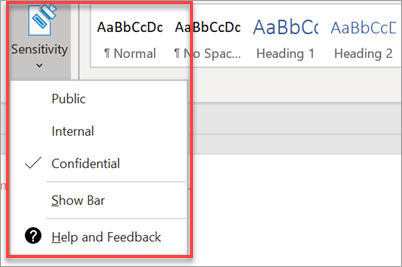

# Konfigurere samsvarsfunksjonerSet up compliance features

Microsoft 365 Business leveres med funksjoner for å beskytte dataene og enhetene dine, og hjelper deg med å holde din og kundenes sensitive informasjon sikker.Your Microsoft 365 Business comes with features to protect your data and devices, and help you keep yours and your customers' sensitive information secure.

## Konfigurere DLP-funksjonerSet up DLP features

Se [Opprette en DLP-policy fra en mal](https://support.office.com/article/59414438-99f5-488b-975c-5023f2254369) for et eksempel på hvordan du konfigurerer en policy for å beskytte mot personlig identifiserbar informasjon (PII).See [Create a DLP policy from a template](https://support.office.com/article/59414438-99f5-488b-975c-5023f2254369) for an example on how to set up a policy to protect against personally identifiable information (PII). 
  
DLP leveres med mange policymaler som er klare til bruk for mange forskjellige nasjonale innstillinger.DLP comes with many ready-to-use policy templates for many different locales. For eksempel Australia Financial Data, Canada Personal Information Act, Us Financial Data, og så videre.For example, Australia Financial Data, Canada Personal Information Act, U.S. Financial Data, and so on. Se [Hva DLP-policymalene inkluderer](https://support.office.com/article/c2e588d3-8f4f-4937-a286-8c399f28953a) for en fullstendig liste.See [What the DLP policy templates include](https://support.office.com/article/c2e588d3-8f4f-4937-a286-8c399f28953a) for a full list. Alle disse malene kan aktiveres på samme måte som pii-maleksemplet.All of these templates can be enabled similar to the PII template example. 
  
## Definere e-postoppbevaring med Exchange Online-arkiveringSet up email retention with Exchange Online Archiving

 **Exchange Online Arkivering** lisensfunksjoner bidrar til å opprettholde samsvar og forskriftsmessige standarder ved å bevare e-postinnhold for eDiscovery.**Exchange Online Archiving** license features help maintain compliance and regulatory standards by preserving email content for eDiscovery. Det bidrar også til å redusere risikoen hvis det er et søksmål, og gir en måte å gjenopprette data etter et sikkerhetsbrudd eller når du trenger å gjenopprette slettede elementer.It also helps reduce your risk if there is a lawsuit, and provides a way to recover data after a security breach or when you need to recover deleted items. Du kan bruke rettstvist hold for å bevare alt innholdet til en bruker, eller bruke oppbevaringspolicyer til å tilpasse det du vil beholde.You can use litigation hold to preserve all of a user's content, or use retention policies to customize what you want to preserve.
  
**Rettstvist hold:** Du kan beholde alt postboksinnhold, inkludert slettede elementer, ved å sette hele postboksen til en bruker på sperrelse av rettssaker.**Litigation hold:** You can preserve all mailbox content including deleted items by putting a user's entire mailbox on litigation hold. 
    
Hvis du vil plassere en postboks på sperrelse, i administrasjonssenteret:To place a mailbox on litigation hold, in the Admin center:
    
1. Gå til **Brukere** \> **aktive brukere**i venstre navigasjonsenhet.In the left nav, go to **Users** \> **Active users**.
    
2. Velg en bruker med postboksen du vil plassere på rettstvisthold.Select a user whose mailbox you want to place on litigation hold. Utvid **E-postinnstillinger**i brukerruten, og velg **Rediger Exchange-egenskaper**ved siden av **Flere innstillinger**.In the user pane, expand **Mail settings**, and next to **More settings**, choose **Edit Exchange properties**.
    
3. Velg \*\* postboksfunksjoner \*\* til venstre navigasjonsenhet på postbokssiden for brukeren, og velg deretter **Aktiver-koblingen** under **Rettstvist hold**.On the mailbox page for the user, choose \*\* mailbox features \*\* on the left nav, and then choose the **Enable** link under **Litigation hold**.
    
4. I dialogboksen Sperre av **rettssaker** kan du angi prosedyresperrevarigheten i feltet **Prosedyresperrevarighet.**In the **litigation hold** dialog box, you can specify the litigation hold duration in the **Litigation hold duration** field. La feltet stå tomt hvis du vil plassere et uendelig hold.Leave the field empty if you want to place an infinite hold. Du kan også legge til notater og lede eieren av postboksen til et webområde du kanskje må forklare mer om rettstvistholdet.You can also add notes and direct the mailbox owner to a website you might have to explain more about the litigation hold. \>**Lagre**.\> **Save**.
    
**Oppbevaring:** Du kan for eksempel aktivere tilpassede oppbevaringspolicyer for å beholde for en bestemt tidsperiode eller slette innhold permanent på slutten av oppbevaringsperioden.**Retention:** You can enable customized retention policies, for example, to preserve for a specific amount of time or delete content permanently at the end of the retention period. Hvis du vil ha mer informasjon, kan du se [Oversikt over oppbevaringspolicyer](https://support.office.com/article/5e377752-700d-4870-9b6d-12bfc12d2423).To learn more, see [Overview of retention policies](https://support.office.com/article/5e377752-700d-4870-9b6d-12bfc12d2423).

## Konfigurere følsomhetsetiketterSet up Sensitivity labels

Følsomhetsetiketter leveres med Azure Information Protection (AIP) Plan 1, og hjelper deg med å klassifisere og eventuelt beskytte dokumenter og e-postmeldinger ved å bruke etiketter.Sensitivity labels come with Azure Information Protection (AIP) Plan 1, and help you classify, and optionally protect your documents and emails, by applying labels. Etiketter kan brukes automatisk av administratorer som definerer regler og betingelser, manuelt av brukere eller ved hjelp av en kombinasjon der brukere får anbefalinger.Labels can be applied automatically by administrators who define rules and conditions, manually by users, or by using a combination where users are given recommendations.

Hvis du vil konfigurere følsomhetsetiketter, kan du vise [opprette og administrere videoen for følsomhetsetiketter.](https://support.office.com/article/2fb96b54-7dd2-4f0c-ac8d-170790d4b8b9)To set up Sensitivity labels, view [create and manage sensitivity labels](https://support.office.com/article/2fb96b54-7dd2-4f0c-ac8d-170790d4b8b9) video.

### Installere Azure Information Protection-klienten manueltInstall the Azure Information Protection client manually

Slik installerer du AIP-klienten manuelt:To manually install the AIP client:

1. Last ned **AzinfoProtection_UL.exe** fra [Microsoft download center](https://www.microsoft.com/download/details.aspx?id=53018).Download **AzinfoProtection_UL.exe** from [Microsoft download center](https://www.microsoft.com/download/details.aspx?id=53018).
 
2. Du kan kontrollere at installasjonen fungerte ved å vise et Word-dokument og sørge for at **følsomhetsalternativet** er tilgjengelig i kategorien **Hjem.**You can verify that the installation worked by viewing a Word document and making sure that the **Sensitivity** option is available on the **Home** tab.
 

Hvis du vil ha mer informasjon, kan du se [Installere klienten](https://docs.microsoft.com/azure/information-protection/infoprotect-tutorial-step3).For more information, see [Install the client](https://docs.microsoft.com/azure/information-protection/infoprotect-tutorial-step3).
