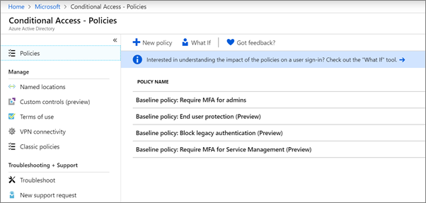

# Definere policyer for betinget tilgang

[Retningslinjer for betinget tilgang](https://docs.microsoft.com/azure/active-directory/conditional-access/overview) legger til betydelig ekstra sikkerhet. Microsoft inneholder et sett med betingelseslinjer for betinget tilgang som anbefales for alle kunder. Grunnlinjepolicyer er et sett med forhåndsdefinerte policyer som bidrar til å beskytte organisasjoner mot mange vanlige angrep. Disse vanlige angrepene kan inkludere passordspray, replay og phishing.

Disse policyene krever at administratorer og brukere angir en annen form for godkjenning (kalt multifaktorautentisering eller MFA) når visse betingelser er oppfylt. Hvis en bruker for eksempel logger på fra et annet land, kan påloggingen anses som risikabelt, og brukeren må oppgi en ekstra form for godkjenning. 

For øyeblikket inkluderer opprinnelige policyer følgende:
- **Kreve MFA for administratorer** &ndash; Krever godkjenning med flere faktorer for de mest privilegerte administratorrollene, inkludert global administrator.
- **Sluttbrukerbeskyttelse** &ndash; Krever godkjenning med flere faktorer for brukere bare når en pålogging er risikabelt. 
- **Blokker eldre godkjenning** &ndash; Eldre klientapper og noen nye apper bruker ikke nyere, sikrere godkjenningsprotokoller. Disse eldre appene kan omgå retningslinjer for betinget tilgang og få uautorisert tilgang til miljøet ditt. Denne policyen blokkerer tilgang fra klienter som ikke støtter betinget tilgang. 
- **Krev MFA for servicebehandling** &ndash; Krever godkjenning med flere faktorer for tilgang til administrasjonsverktøy, inkludert Azure-portal (der du konfigurerer opprinnelige policyer). 

Microsoft anbefaler at du aktiverer alle disse grunnlinjepolicyene. Når disse policyene er aktivert, blir administratorer og brukere bedt om å registrere seg for Azure Multii-Factor-godkjenning.

Hvis du vil ha mer informasjon om disse policyene, kan du se [Hva er policyer for opprinnelig plan?](https://docs.microsoft.com/azure/active-directory/conditional-access/concept-baseline-protection)

## Definere policyer for opprinnelig plan

1. Gå til [Azure-portalen](https://portal.azure.com), og naviger deretter til **Azure Active Directory** \> **Betinget tilgang**.
    
    Policyene for opprinnelig plan er oppført på siden.    
    
1. Se følgende spesifikke instruksjoner for hver policy:

  - [Kreve MFA for administratorer](https://docs.microsoft.com/azure/active-directory/conditional-access/howto-baseline-protect-administrators)
- [Kreve MFA for brukere](https://docs.microsoft.com/azure/active-directory/conditional-access/howto-baseline-protect-end-users)  
 - [Blokkere eldre godkjenning](https://docs.microsoft.com/azure/active-directory/conditional-access/howto-baseline-protect-legacy-auth)
  - [Kreve MFA for serviceadministrasjon](https://docs.microsoft.com/azure/active-directory/conditional-access/howto-baseline-protect-azure)

Du kan definere mange tilleggspolicyer, for eksempel kreve godkjente klientapper. Hvis du vil ha mer informasjon, kan du se [dokumentasjonen for betinget tilgang](https://docs.microsoft.com/azure/active-directory/conditional-access/).
