# Konfigurere mobile enheter for Brukere av Microsoft 365 for bedrifter

Følg instruksjonene i fanene for å installere Office på iPhone eller en Android-telefon. Når du har fulgt disse trinnene, beskyttes arbeidsfilene som er opprettet i Office-apper, av Microsoft 365 for bedrifter.

Eksemplet gjelder for Outlook, men det gjelder også for alle andre Office-programmer du ønsker å installere.
  
## Konfigurere mobile enheter

## [Iphone](#tab/iPhone)
  
Se en kort video om hvordan du konfigurerer Office-apper på iOS-enheter med Microsoft 365 for bedrifter.  

> [!VIDEO https://www.microsoft.com/videoplayer/embed/RWee2n] 

Hvis du synes at denne videoen er nyttig, kan du se den [fullstendige opplæringsserien for små bedrifter og de som er nybegynnere i Microsoft 365](https://support.microsoft.com/office/6ab4bbcd-79cf-4000-a0bd-d42ce4d12816).

Gå til **App store**, og skriv inn i søkefeltet Microsoft Outlook.
  
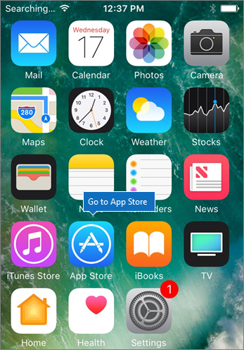
  
Trykk på skyikonet for å installere Outlook.
  
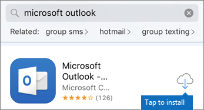
  
Når installasjonen er gjennomført, trykk på **Åpne**-knappen for å åpne Outlook, og trykk deretter på **Komme i gang**.
  
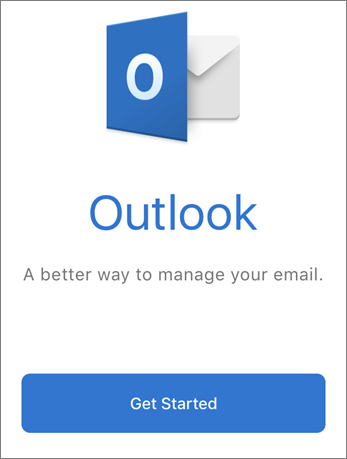
  
Skriv inn jobb-e-postadressen på **skjermbildet Legg til e-postkonto,** legg \> **til konto**, og skriv deretter inn påloggingsinformasjonen for Microsoft 365 for bedrifter \> **Logg på**.
  
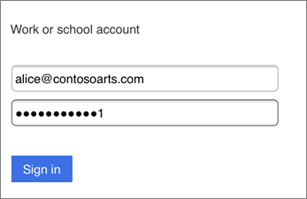
  
Hvis organisasjonen beskytter filer i apper, ser du en dialogboks som sier at organisasjonen nå beskytter dataene i appen, og du må starte appen på nytt for å fortsette å bruke den. Trykk på **OK**, og lukk Outlook. 
  
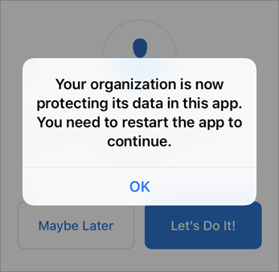
  
Finn Outlook på iPhonen, og start den på nytt. Når du blir bedt om det, angir du en PIN-kode og kontrollerer den. Outlook på iPhonen din er nå klar til å brukes.
  
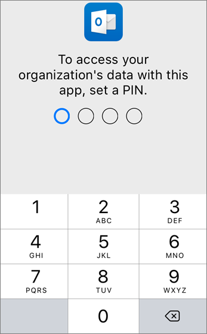
  
## [Android](#tab/Android)
  
Se en video om hvordan du installerer Outlook og Office på Android-enheter.  

> [!VIDEO https://www.microsoft.com/videoplayer/embed/ecc2e9c0-bc7e-4f26-8b14-91d84dbcfef0] 

Hvis du synes at denne videoen er nyttig, kan du se den [fullstendige opplæringsserien for små bedrifter og de som er nybegynnere i Microsoft 365](https://support.microsoft.com/office/6ab4bbcd-79cf-4000-a0bd-d42ce4d12816).

Gå til Play Butikk for å begynne å konfigurere på Android-telefonen.
  
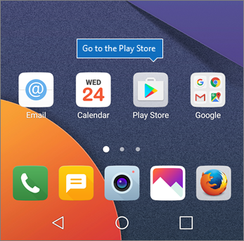
  
Skriv inn Microsoft Outlook i søkeboksen for Google Play, og trykk **installer**. Når Outlook er ferdig installert, trykker du **Åpne**.
  
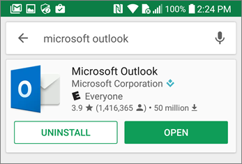
  
Trykk Kom i **gang i**Outlook-appen , og legg deretter til e-postkontoen for Microsoft 365 for bedrifter \> **Fortsett**, og logg på med organisasjonslegitimasjonen.
  
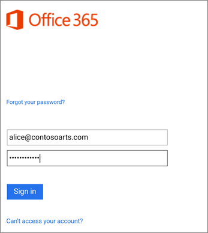
  
Trykk på **Gå til butikk** i dialogboksen som sier du må installere Intune Company Portal-appen.
  
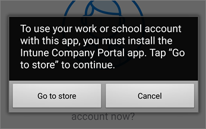
  
Installer Intune Company Portal i Play Store.
  
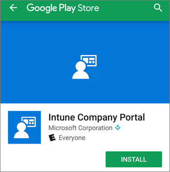
  
Open Outlook again, and enter and confirm a PIN. Your Outlook app is now ready for use.
  
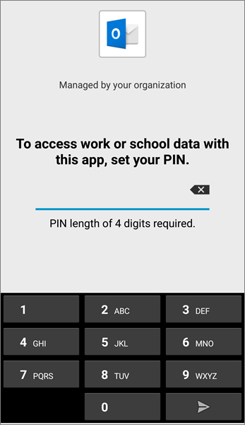

## Se også

[Opplæringsvideoer for Microsoft 365 for bedrifter](https://support.microsoft.com/office/6ab4bbcd-79cf-4000-a0bd-d42ce4d12816)

---
