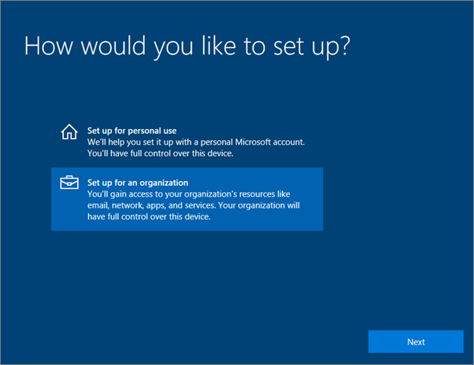
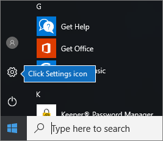
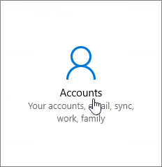
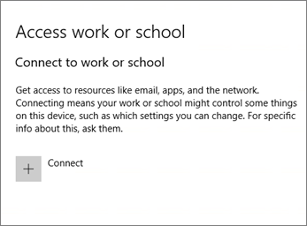
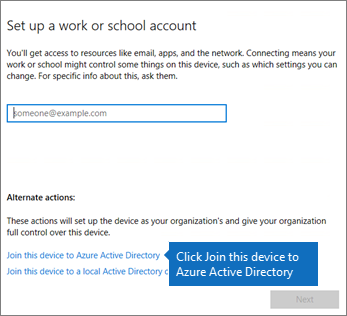
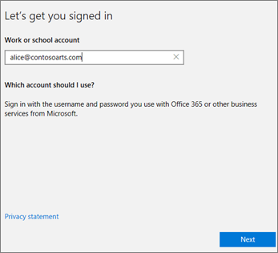
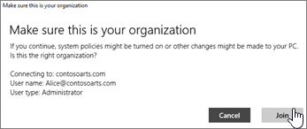
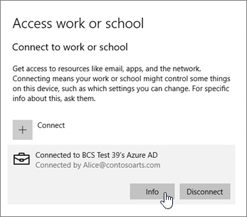
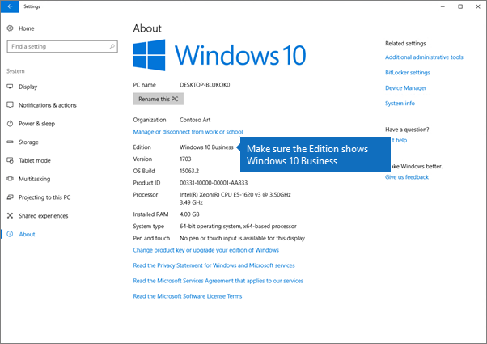

# Konfigurere Windows-enheter for Microsoft 365 Business Premium-brukereSet up Windows devices for Microsoft 365 Business Premium users

## Forutsetninger for å konfigurere Windows-enheter for Microsoft 365 Business Premium-brukerePrerequisites for setting up Windows devices for Microsoft 365 Business Premium users

Før du kan konfigurere Windows-enheter for Microsoft 365 Business Premium-brukere, må du kontrollere at alle Windows-enhetene kjører Windows 10 Pro, versjon 1703 (Creators Update).Before you can set up Windows devices for Microsoft 365 Business Premium users, make sure all the Windows devices are running Windows 10 Pro, version 1703 (Creators Update). Windows 10 Pro er en forutsetning for distribusjon av Windows 10 Business, som er et sett med Sky tjenester og enhets behandlings funksjoner som komplementerer Windows 10 Pro og aktiverer sentralisert administrasjon og sikkerhets kontroller i Microsoft 365 Business Premium.Windows 10 Pro is a prerequisite for deploying Windows 10 Business, which is a set of cloud services and device management capabilities that complement Windows 10 Pro and enable the centralized management and security controls of Microsoft 365 Business Premium.
  
Hvis du har Windows-enheter som kjører Windows 7 Pro, Windows 8 Pro eller Windows 8,1 Pro, gir Microsoft 365 Business Premium-abonnementet deg en Windows 10-oppgradering.If you have Windows devices running Windows 7 Pro, Windows 8 Pro, or Windows 8.1 Pro, your Microsoft 365 Business Premium subscription entitles you to a Windows 10 upgrade.
  
Hvis du vil ha mer informasjon om hvordan du oppgraderer Windows-enheter til Windows 10 Pro Creators Update, følger du fremgangsmåten i dette emnet: [Oppgradere Windows-enheter til Windows Pro Creators Update](upgrade-to-windows-pro-creators-update.md).For more information on how to upgrade Windows devices to Windows 10 Pro Creators Update, follow the steps in this topic: [Upgrade Windows devices to Windows Pro Creators Update](upgrade-to-windows-pro-creators-update.md).
  
Se [bekrefte at enheten er koblet til Azure ad](#verify-the-device-is-connected-to-azure-ad) for å bekrefte at du har oppgraderingen, eller for å sikre at oppgraderingen fungerte.See [Verify the device is connected to Azure AD](#verify-the-device-is-connected-to-azure-ad) to verify you have the upgrade, or to make sure the upgrade worked.

Se en kort video om hvordan du kobler Windows til Microsoft 365.Watch a short video about connecting Windows to Microsoft 365.  

> [!VIDEO https://www.microsoft.com/videoplayer/embed/RE3yXh3] 

Hvis du synes at denne videoen er nyttig, kan du se den [fullstendige opplæringsserien for små bedrifter og de som er nybegynnere i Microsoft 365](https://support.microsoft.com/office/6ab4bbcd-79cf-4000-a0bd-d42ce4d12816).If you found this video helpful, check out the [complete training series for small businesses and those new to Microsoft 365](https://support.microsoft.com/office/6ab4bbcd-79cf-4000-a0bd-d42ce4d12816).
  
## Slå sammen Windows 10-enheter med organisasjonens Azure ADJoin Windows 10 devices to your organization's Azure AD

Når alle Windows-enheter i organisasjonen enten er oppgradert til Windows 10 Pro Creators Update eller allerede kjører Windows 10 Pro Creators Update, kan du bli med i disse enhetene i organisasjonens Azure Active Directory.When all Windows devices in your organization have either been upgraded to Windows 10 Pro Creators Update or are already running Windows 10 Pro Creators Update, you can join these devices to your organization's Azure Active Directory. Når enhetene er slått sammen, oppgraderes de automatisk til Windows 10 Business, som er en del av Microsoft 365 Business Premium-abonnementet ditt.Once the devices are joined, they'll be automatically upgraded to Windows 10 Business, which is part of your Microsoft 365 Business Premium subscription.
  
### Hvis du har en helt ny eller nylig oppgradert Windows 10 Pro-enhetFor a brand new, or newly upgraded, Windows 10 Pro device

Hvis du har en helt ny enhet som kjører Windows 10 Pro Creators Update eller en enhet som ble oppgradert til Windows 10 Pro Creators Update, men ikke har gått gjennom konfigurasjon for Windows 10-enheter, følger du disse trinnene.For a brand new device running Windows 10 Pro Creators Update, or for a device that was upgraded to Windows 10 Pro Creators Update but has not gone through Windows 10 device setup, follow these steps.
  
1. Gå gjennom konfigurasjonen for Windows 10-enheter frem til **Hvordan vil du konfigurere?** -siden.Go through Windows 10 device setup until you get to the **How would you like to set up?** page. 
    
    
  
2. Velg **Konfigurer for en organisasjon** , og skriv deretter inn bruker navn og passord for Microsoft 365 Business Premium.Here, choose **Set up for an organization** and then enter your username and password for Microsoft 365 Business Premium. 
    
3. Fullfør konfigurasjonen for Windows 10-enheter.Finish Windows 10 device setup.
    
   Når du er ferdig, vil brukeren bli koblet til organisasjonens Azure AD. Se [Kontroller at enheten er koblet til Azure AD](#verify-the-device-is-connected-to-azure-ad) for å være sikker.Once you're done, the user will be connected to your organization's Azure AD. See [Verify the device is connected to Azure AD](#verify-the-device-is-connected-to-azure-ad) to make sure. 
  
### Hvis du har en enhet som allerede er konfigurert og kjører Windows 10 ProFor a device already set up and running Windows 10 Pro

 **Koble brukere til Azure AD:****Connect users to Azure AD:**
  
1. I brukerens Windows-PC som kjører Windows 10 Pro, versjon 1703 (Creators Update) (se [forhåndskrav](pre-requisites-for-data-protection.md)), klikk på Windows-logoen og deretter på Innstillinger-ikonet.In your user's Windows PC, that is running Windows 10 Pro, version 1703 (Creators Update) (see [pre-requisites](pre-requisites-for-data-protection.md)), click the Windows logo, and then the Settings icon.
  
   
  
2. Gå til **Kontoer** i **Innstillinger**.In **Settings** , go to **Accounts**.
  
   
  
3. Klikk på **Tilgang jobb eller skole**\> på **Din informasjon** -side.On **Your info** page, click **Access work or school** \> **Connect**.
  
   
  
4. Velg **Legg denne enheten til Azure Active Directory** under **Alternative handlinger** på **Konfigurer en arbeids- eller skolekonto** -dialogboksen.On the **Set up a work or school account** dialog, under **Alternate actions** , choose **Join this device to Azure Active Directory**.
  
   
  
5. Skriv inn jobb-eller skole kontoen din på siden **La oss få deg pålogget** \> **Next**.On the **Let's get you signed in** page, enter your work or school account \> **Next**.
  
   Skriv inn passordet på **Skriv ut passord** -siden \> **Sign in**.On the **Enter password** page, enter your password \> **Sign in**.
  
   
  
6. Kontroller at informasjonen er riktig, og velg **bli med** i siden **Kontroller at dette er organisasjonen din** .On the **Make sure this is your organization** page, verify that the information is correct, and choose **Join**.
  
   På **alt er du klar!**On the **You're all set!** side, chosse **ferdig**.page, chosse **Done**.
  
   
  
Hvis du har lastet opp filer til OneDrive for Business, synkroniser dem tilbake.If you uploaded files to OneDrive for Business, sync them back down. Hvis du brukte et tredje parts verktøy til å overføre profil og filer, må du også synkronisere dem med den nye profilen.If you used a third-party tool to migrate profile and files, also sync those to the new profile.
  
## Kontroller at enheten er koblet til Azure ADVerify the device is connected to Azure AD

Hvis du vil kontrollere synkroniserings statusen din, velger du **koblet til** _ _-området på siden for **tilgang til jobb eller skole** under **Innstillinger** \<organization name\> for å vise knappe **informasjonen** og **Koble fra**.To verify your sync status, on the **Access work or school** page in **Settings** , select the **Connected to** _ \<organization name\> _ area to expose the buttons **Info** and **Disconnect**. Velg **info** for å få synkroniserings statusen din.Choose **Info** to get your synchronization status. 
  
På siden **synkroniserings status** velger du **Synkroniser** for å få de nyeste administrasjons policyene for mobil enheter på PC-en.On the **Sync status** page, choose **Sync** to get the latest mobile device management policies onto the PC.
  
Hvis du vil begynne å bruke Microsoft 365 Business Premium-kontoen, går du til **Start** -knappen i Windows, høyre klikker på gjeldende konto bilde og **bytter konto**.To start using the Microsoft 365 Business Premium account, go to the Windows **Start** button, right-click your current account picture, and then **Switch account**. Logg på ved hjelp av organisasjons e-post og passord.Sign in by using your organization email and password.
  

  
## Kontroller at PC-en er oppgradert til Windows 10 BusinessVerify the PC is upgraded to Windows 10 Business

Kontroller at Azure AD-tilknyttede Windows 10-enheter oppgraderes til Windows 10 Business som en del av Microsoft 365 Business Premium-abonnementet.Verify that your Azure AD joined Windows 10 devices are upgraded to Windows 10 Business as part of your Microsoft 365 Business Premium subscription.
  
1. Gå til **Innstillinger** \> **System** \> **Om**.Go to **Settings** \> **System** \> **About**.
    
2. Kontroller at **Versjon** viser **Windows 10 Business**.Confirm that the **Edition** shows **Windows 10 Business**.
    
    
  
## Neste trinnNext steps

Hvis du vil konfigurere mobile enheter, kan du se [konfigurere mobile enheter for Microsoft 365 Business Premium-brukere](set-up-mobile-devices.md), se [administrere Microsoft 365 for Business](manage.md)hvis du vil angi policyer for enhets beskyttelse eller app-beskyttelse.To set up your mobile devices, see [Set up mobile devices for Microsoft 365 Business Premium users](set-up-mobile-devices.md), To set device protection or app protection policies, see [Manage Microsoft 365 for business](manage.md).
  
## Hvis du vil ha mer informasjon om hvordan du konfigurerer og bruker Microsoft 365 Business PremiumFor more on setting up and using Microsoft 365 Business Premium

[Opplærings videoer for Microsoft 365 for bedrifterMicrosoft 365 for business training videos](https://support.microsoft.com/office/6ab4bbcd-79cf-4000-a0bd-d42ce4d12816)
