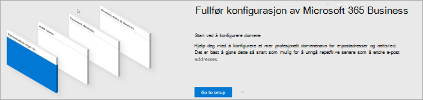
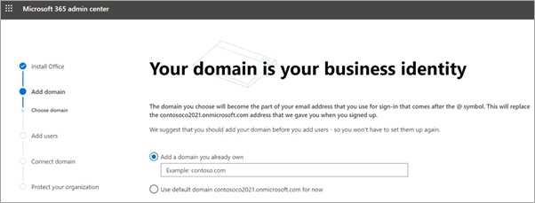
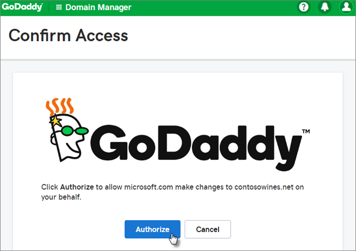
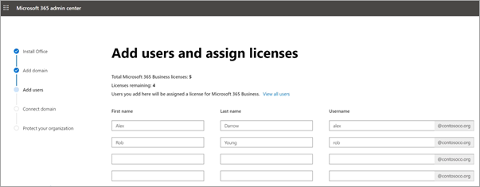
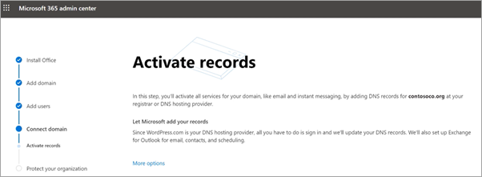
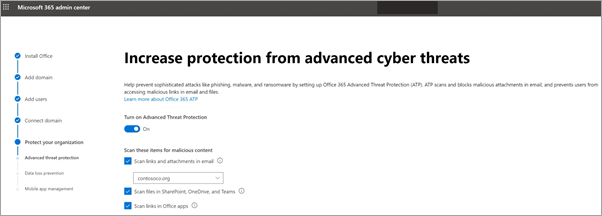
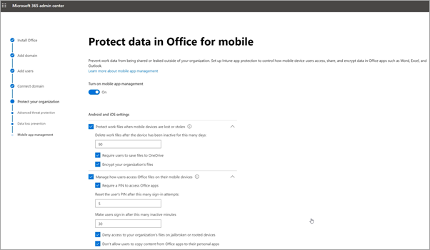

# Konfigurere Microsoft 365 Business Premium i konfigurasjonsveiviserenSet up Microsoft 365 Business Premium in the setup wizard

Se denne videoen for å få en oversikt over konfigurasjon av Microsoft 365 Business Premium.Watch this video for an overview of Microsoft 365 Business Premium setup.  

> [!VIDEO https://www.microsoft.com/videoplayer/embed/RE4jZwg] 

## Legge til domenet ditt, brukere og konfigurere policyerAdd your domain, users, and set up policies

Når du kjøper Microsoft 365 Business Premium, kan du bruke et domene du eier, eller kjøpe et under [registreringen.](sign-up.md)When you purchase Microsoft 365 Business Premium, you have the option of using a domain you own, or buying one during the [sign-up](sign-up.md).

- Hvis du kjøpte et nytt domene da du registrerte deg, er domenet konfigurert, og du kan flytte til Legg til brukere og [tilordne lisenser.](#add-users-and-assign-licenses)If you purchased a new domain when you signed up, your domain is all set up and you can move to [Add users and assign licenses](#add-users-and-assign-licenses).

### Legge til domenet for å tilpasse påloggingAdd your domain to personalize sign-in

1. Logg på [administrasjonssenteret for Microsoft 365](https://admin.microsoft.com) ved hjelp av legitimasjonen for global administrator.Sign in to [Microsoft 365 admin center](https://admin.microsoft.com) by using your global admin credentials. 

2. Velg **Gå til konfigurasjon for** å starte veiviseren.Choose **Go to setup** to start the wizard.

    

3. På siden **Installer Office-apper** kan du også installere appene på din egen datamaskin.On the **Install your Office apps** page, you can optionally install the apps on your own computer.
    
4. I **trinnet Legg til** domene skriver du inn domenenavnet du vil bruke (for contoso.com).In the **Add domain** step, enter the domain name you want to use (like contoso.com).

    > [!IMPORTANT]
    > Hvis du kjøpte et domene under registreringen, ser du ikke Legg til **et domene-trinn** her.If you purchased a domain during the sign-up, you will not see **Add a domain** step here. Gå til [Legg til brukere i](#add-users-and-assign-licenses) stedet.Go to [Add users](#add-users-and-assign-licenses) instead.

    

    
4. Følg fremgangsmåten i veiviseren for å [opprette DNS-poster hos en DNS-vert for Microsoft 365](https://docs.microsoft.com/office365/admin/get-help-with-domains/create-dns-records-at-any-dns-hosting-provider) som bekrefter at du eier domenet.Follow the steps in the wizard to [Create DNS records at any DNS hosting provider for Microsoft 365](https://docs.microsoft.com/office365/admin/get-help-with-domains/create-dns-records-at-any-dns-hosting-provider) that verifies you own the domain. Hvis du kjenner domeneverten, kan du også se [vertens spesifikke instruksjoner.](https://docs.microsoft.com/office365/admin/get-help-with-domains/set-up-your-domain-host-specific-instructions)If you know your domain host, see also the [host specific instructions](https://docs.microsoft.com/office365/admin/get-help-with-domains/set-up-your-domain-host-specific-instructions).

    Hvis vertsleverandøren er GoDaddy eller en annen vert som er aktivert med domenekryssing, er prosessen enkel, og du blir automatisk bedt om å logge på og la Microsoft godkjenne på dine vegne.If your hosting provider is GoDaddy or another host enabled with [domain connect](https://docs.microsoft.com/office365/admin/get-help-with-domains/domain-connect), the process is easy and you'll be automatically asked to sign in and let Microsoft authenticate on your behalf.

    

### Legge til brukere og tilordne lisenserAdd users and assign licenses

Du kan legge til brukere i veiviseren, men du kan også [legge til brukere senere](add-users-m365b.md) i administrasjonssenteret.You can add users in the wizard, but you can also [add users later](add-users-m365b.md) in the admin center. Hvis du har en lokal domenekontroller, kan du i tillegg legge til brukere [med Azure AD Connect.](https://docs.microsoft.com/azure/active-directory/hybrid/how-to-connect-install-express)Additionally, if you have a local domain controller, you can add users with [Azure AD Connect](https://docs.microsoft.com/azure/active-directory/hybrid/how-to-connect-install-express).

#### Legge til brukere i veiviserenAdd users in the wizard

Alle brukere du legger til i veiviseren, tilordnes automatisk en Lisens for Microsoft 365 Business Premium.Any users you add in the wizard get automatically assigned a Microsoft 365 Business Premium license.

1. Hvis Microsoft 365 Business Premium-abonnementet har eksisterende brukere (for eksempel hvis du brukte Azure AD Connect), får du et alternativ for å tilordne lisenser til dem nå.If your Microsoft 365 Business Premium subscription has existing users (for example, if you used Azure AD Connect), you get an option to assign licenses to them now. Gå videre og legg til lisenser for dem også.Go ahead and add licenses to them as well.

2. Når du har lagt til brukerne, får du også et alternativ for å dele legitimasjon med de nye brukerne du har lagt til.After you've added the users, you'll also get an option to share credentials with the new users you added. Du kan velge å skrive dem ut, sende dem via e-post eller laste dem ned.You can choose to print them out, email them, or download them.

### Koble til domenet dittConnect your domain

> [!NOTE]
> Hvis du valgte å bruke .onmicrosoft-domenet, eller brukte Azure AD Connect til å konfigurere brukere, vil du ikke se dette trinnet.If you chose to use the .onmicrosoft domain, or used Azure AD Connect to set up users, you will not see this step.
  
Hvis du vil konfigurere tjenester, må du oppdatere noen poster på DNS-verten eller domeneregistratoren.To set up services, you have to update some records at your DNS host or domain registrar.
  
1. Oppsettsveiviseren oppdager vanligvis registratoren og gir deg en kobling til trinnvise instruksjoner for hvordan du oppdaterer NS-postene på nettstedet til registratoren.The setup wizard typically detects your registrar and gives you a link to step-by-step instructions for updating your NS records at the registrar website. Hvis den ikke gjør det, [endrer du navneservere for å konfigurere Microsoft 365 med en hvilken som helst domeneregistrator.](https://docs.microsoft.com/microsoft-365/admin/get-help-with-domains/change-nameservers-at-any-domain-registrar)If it doesn't, [Change nameservers to set up Microsoft 365 with any domain registrar](https://docs.microsoft.com/microsoft-365/admin/get-help-with-domains/change-nameservers-at-any-domain-registrar). 

    - Hvis du har eksisterende DNS-poster, for eksempel et eksisterende nettsted, men DNS-verten er aktivert for [domene](https://docs.microsoft.com/office365/admin/get-help-with-domains/domain-connect)connect, velger du Legg **til poster for meg.**If you have existing DNS records, for example an existing web site, but your DNS host is enabled for [domain connect](https://docs.microsoft.com/office365/admin/get-help-with-domains/domain-connect), choose **Add records for me**. Godta alle **standardinnstillingene på** siden Velg nettjenester, og velg  **Neste,** og velg Autoriser på siden til DNS-verten.On the **Choose your online services** page, accept all the defaults, and choose **Next**, and choose **Authorize** on your DNS host's page.
    - Hvis du har eksisterende DNS-poster med andre DNS-verter (ikke aktivert for domenekoblet), må du administrere dine egne DNS-poster for å sikre at de eksisterende tjenestene forblir tilkoblet.If you have existing DNS records with other DNS hosts (not enabled for domain connect), you'll want to manage your own DNS records to make sure the existing services stay connected. Se [grunnleggende funksjoner](https://docs.microsoft.com/office365/admin/get-help-with-domains/dns-basics) for domenet hvis du vil ha mer informasjon.See [domain basics](https://docs.microsoft.com/office365/admin/get-help-with-domains/dns-basics) for more info.

        

2. Følg trinnene i veiviseren, og e-post og andre tjenester vil bli konfigurert for deg.Follow the steps in the wizard and email and other services will be set up for you.

### Beskytte organisasjonenProtect your organization 

Policyene du konfigurerte i veiviseren, brukes automatisk på en [sikkerhetsgruppe](https://docs.microsoft.com/office365/admin/create-groups/compare-groups#security-groups) kalt *Alle brukere.*The policies you set up in the wizard are applied automatically to a [Security group](https://docs.microsoft.com/office365/admin/create-groups/compare-groups#security-groups) called *All Users*. Du kan også opprette flere grupper for å tilordne policyer til i administrasjonssenteret.You can also create additional groups to assign policies to in the admin center.

1. På Øk beskyttelse fra avanserte **datatrusler** anbefales det at du godtar standardverdiene for å la [Office 365 Advance Threat Protection](https://docs.microsoft.com/microsoft-365/security/office-365-security/office-365-atp) skanne filer og koblinger i Office-apper.On the **Increase protection from advanced cyber threats**, it is recommended that you accept the defaults to let [Office 365 Advance Threat Protection](https://docs.microsoft.com/microsoft-365/security/office-365-security/office-365-atp) scan files and links in Office apps.

    

2. Godta standardinnstillingen for å slå på Office 365 Data Loss Prevention (DLP) for å spore sensitive data i Office-apper og forhindre utilsiktet deling av disse utenfor organisasjonen, på siden Forhindre lekkasje av sensitive **data.**On the **Prevent leaks of sensitive data** page, accept the defaults to turn on Office 365 Data Loss Prevention (DLP) to track sensitive data in Office apps and prevent the accidental sharing of these outside your organization.

3. La administrasjon av mobilapper være på, utvid innstillingene og se gjennom dem, og velg deretter Opprett policy for administrasjon av **mobilapper** på siden Beskytt data i **Office for** mobil.On the **Protect data in Office for mobile** page, leave mobile app management on, expand the settings and review them, and then select **Create mobile app management policy**.

    

## Sikre PC-er med Windows 10Secure Windows 10 PCs

Velg Konfigurer til  venstre, og velg deretter Sikre **Windows 10-datamaskinene** under Pålogging og sikkerhet. On the left nav, select **Setup** and then, under **Sign-in and security**, choose **Secure your Windows 10 computers**. Velg **Vis for** å komme i gang.Choose **View** to get started. Se [sikre Windows 10-datamaskiner](secure-win-10-pcs.md) for fullstendige instruksjoner.See [secure your Windows 10 computers](secure-win-10-pcs.md) for complete instructions.

## Distribuere Office 365-klientapperDeploy Office 365 client apps

Hvis du velger å installere Office-apper automatisk under installasjonen, installeres appene på Windows 10-enhetene når brukerne har logget på Azure AD fra Windows-enhetene sine ved hjelp av jobblegitimasjonen.If you chose to automatically install Office apps during setup, the apps will install on the Windows 10 devices once the users have signed in to Azure AD from their Windows devices, using their work credentials.

Hvis du vil installere Office på mobile iOS- eller Android-enheter, kan du se Konfigurere mobile enheter for Brukere av [Microsoft 365 Business Premium.](set-up-mobile-devices.md)To install Office on mobile iOS or Android devices, see [Set up mobile devices for Microsoft 365 Business Premium users](set-up-mobile-devices.md).

Du kan også installere Office enkeltvis.You can also install Office individually. Se [installere Office på en PC eller Mac](https://support.microsoft.com/office/4414eaaf-0478-48be-9c42-23adc4716658) for instruksjoner.See [install Office on a PC or Mac](https://support.microsoft.com/office/4414eaaf-0478-48be-9c42-23adc4716658) for instructions.

## Se ogsåSee also

[Opplæringsvideoer for Microsoft 365 for bedrifterMicrosoft 365 for business training videos](https://support.microsoft.com/office/6ab4bbcd-79cf-4000-a0bd-d42ce4d12816)
