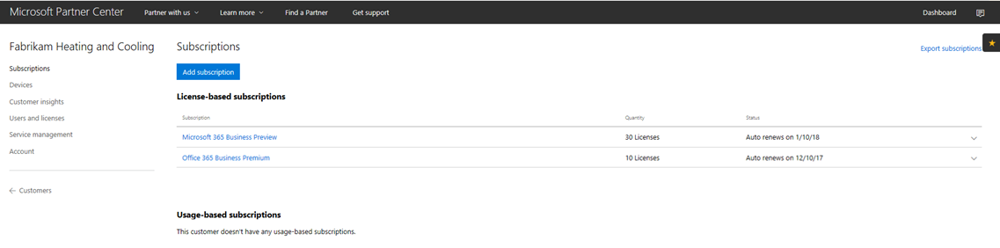
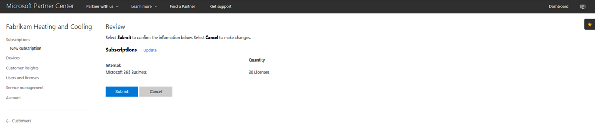
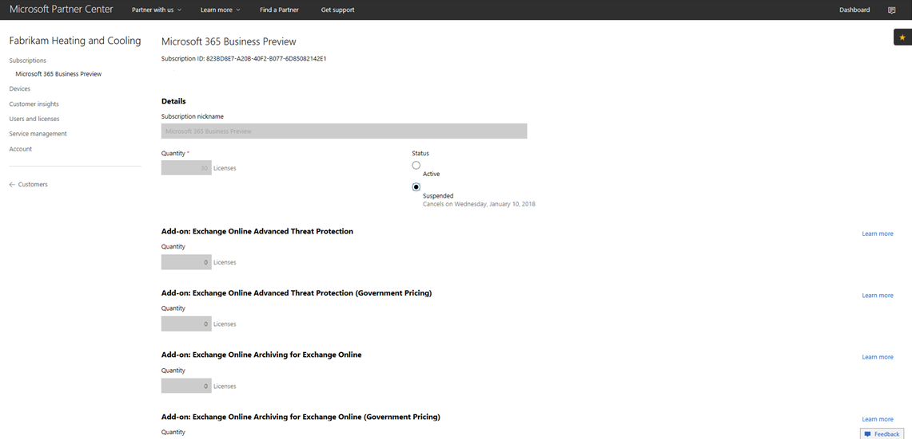
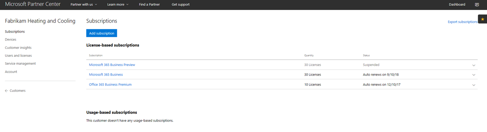
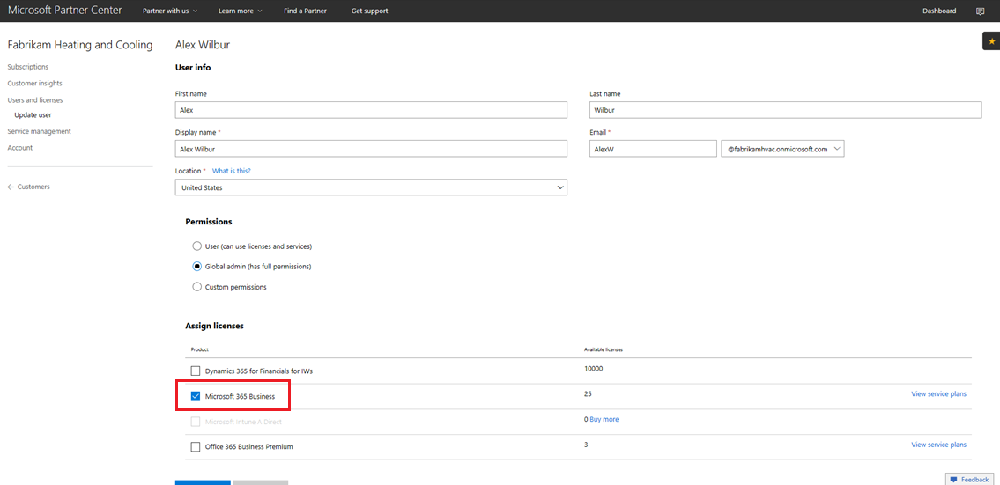

# Overgang til et Microsoft 365 Business CSP-abonnement

Hvis du har et Microsoft 365 Business Preview CSP-abonnement, følger du denne veiledningen for å finne ut hvordan du kan endre det eksisterende forhåndsvisningsabonnementet til Microsoft 365 Business GA (generell tilgjengelighet).

**Slik går du over et forhåndsversjonsabonnement til GA**

1. Logg på <a href="https://partnercenter.microsoft.com" target="_blank">Partnersenter</a>.
2. Velg Kunder på **instrumentbordet,** og finn og velg deretter firmanavnet.

    Abonnementene for firmaet vil bli oppført.

    
    
3. Velg Legg til abonnement på **firmaets** **Abonnementer-side.**
4. Velg **Småbedrifter**  på Nytt **abonnement-siden,** og velg Microsoft 365 Business fra listen.
5. Legg til antall lisenser, og velg deretter **Neste: Se** gjennom for å se gjennom abonnementet, og velg deretter **Send inn**.

    

    De **lisensbaserte abonnementene** viser Microsoft 365 **Business Preview** og Microsoft 365 **Business**. Du stopper forhåndsversjonen av abonnementet.

6. Velg **Microsoft 365 Business Preview**.
7. På siden **Microsoft 365 Business Preview** velger du **Utestengt for** å stoppe forhåndsversjonen av abonnementet.

    

8. Velg **Send for** å bekrefte.

    På **Abonnementer-siden** bekrefter du at statusen **Microsoft 365 Business Preview** viser **Deaktivert**.

    

9. Du kan også validere lisensavtalen. Dette gjør du slik:
    1. Velg **Brukere og lisenser** fra **firmaets Abonnementer-side.**
    2. Velg en **bruker på** Siden Brukere og lisenser.
    3. Merk av for Tilordne lisenser på **brukerens** side, og bekreft at den viser **Microsoft 365 Business**.

        

## Innvirkning for kunder og brukere under og etter overgangen

Det har ingen innvirkning på kunder og brukere under overgangen og etter overgangen.

## Innvirkning på kunder som ikke har overgang

Tabellen nedenfor oppsummerer virkningen for kunder som ikke går over fra et Microsoft 365 Business Preview-abonnement til et Microsoft 365 Business-abonnement.

|       | T-0 til T+30     | T+30 til T+60 | T+60 til T+120 | Utover T+120  |
|-------|-----------------|--------------|---------------|---------------|
| **Tilstand** | I løpeperioden | Utløpt      | Deaktivert      | Deprovisioned |
| **Tjenestepåvirkninger**                                                        |
| **Administrasjonssenter for Microsoft 365** | Ingen innvirkning på funksjonaliteten | Ingen innvirkning på funksjonaliteten | Kan legge til/slette brukere, kjøpe abonnementer.  Kan ikke tilordne/oppheve lisenser. | Kundens abonnement og alle data slettes. Administrator kan administrere andre betalte abonnementer. |
| **Office apper**                         | Ingen innvirkning på sluttbrukeren | Ingen innvirkning på sluttbrukeren | Office går inn i modus for redusert funksjonalitet.  Brukere kan bare vise filer. | Office går inn i modus for redusert funksjonalitet.  Brukere kan bare vise filer. |
| **Skytjenester (SharePoint Online, Exchange Online, Skype, Teams og mer)** | Ingen innvirkning på sluttbrukeren | Ingen innvirkning på sluttbrukeren | Sluttbrukere og administratorer har ingen tilgang til data i skyen. | Kundens abonnement og alle data slettes. |
| **EM+S-komponenter** | Ingen administratorpåvirkning  Ingen innvirkning på sluttbrukeren | Ingen administratorpåvirkning  Ingen innvirkning på sluttbrukeren | Funksjonaliteten håndheves ikke lenger.  Hvis [du vil ha mer informasjon,](#mobile-device-impacts-upon-subscription-expiration) kan du [Windows 10](#windows-10-pc-impacts-upon-subscription-expiration) innvirkning på mobilenheten når abonnementet utløper. | Funksjonaliteten håndheves ikke lenger.  Hvis [du vil ha mer informasjon,](#mobile-device-impacts-upon-subscription-expiration) kan du [Windows 10](#windows-10-pc-impacts-upon-subscription-expiration) innvirkning på mobilenheten når abonnementet utløper. |
| **Windows 10 Business** | Ingen administratorpåvirkning  Ingen innvirkning på sluttbrukeren | Ingen administratorpåvirkning  Ingen innvirkning på sluttbrukeren | Funksjonaliteten håndheves ikke lenger.  Hvis [du vil ha mer informasjon,](#mobile-device-impacts-upon-subscription-expiration) kan du [Windows 10](#windows-10-pc-impacts-upon-subscription-expiration) innvirkning på mobilenheten når abonnementet utløper. | Funksjonaliteten håndheves ikke lenger.  Hvis [du vil ha mer informasjon,](#mobile-device-impacts-upon-subscription-expiration) kan du [Windows 10](#windows-10-pc-impacts-upon-subscription-expiration) innvirkning på mobilenheten når abonnementet utløper. |
| **Azure AD-pålogging til en Windows 10 PC** | Ingen administratorpåvirkning  Ingen innvirkning på sluttbrukeren | Ingen administratorpåvirkning  Ingen innvirkning på sluttbrukeren | Ingen administratorpåvirkning  Ingen innvirkning på sluttbrukeren | Når leieren er slettet, kan en bruker bare logge på med lokal legitimasjon. Ta bilde av enheten på nytt hvis det ikke er noen lokal legitimasjon. |

## Innvirkning på mobilenhet når abonnementet utløper

Tabellen nedenfor oppsummerer innvirkningen på policyene for appbehandling på mobile enheter.

|                            | Fullstendig lisensiert opplevelse                      | T+60 dager etter utløp          |
|----------------------------|------------------------------------------------|------------------------------------|
| **Slette arbeidsfiler fra en inaktiv enhet** | Arbeidsfiler fjernes etter valgte dager | Arbeidsfiler forblir på brukerens personlige enheter |
| **Tvinge brukere til å lagre alle arbeidsfiler til OneDrive for Business** | Arbeidsfiler kan bare lagres i OneDrive for Business | Arbeidsfiler kan lagres hvor som helst |
| **Kryptere arbeidsfiler** | Arbeidsfiler krypteres | Arbeidsfiler krypteres ikke lenger.  Sikkerhetspolicyer fjernes og Office data på apper fjernes. |
| **Krev PIN-kode eller fingeravtrykk for å Office apper** | Begrenset tilgang til apper | Ingen tilgangsbegrensning på appnivå |
| **Tilbakestill PIN-kode når påloggingen mislykkes** | Begrenset tilgang til apper | Ingen tilgangsbegrensning på appnivå |
| **Krev at brukere logger på på nytt Office har vært inaktive** | Pålogging kreves | Ingen pålogging kreves |
| **Avslå tilgang til arbeidsfiler på enheter som er jailbreaket eller rootet** | Arbeidsfiler er ikke tilgjengelig på enheter med jailbroken/rooted | Arbeidsfiler kan nås på jailbroken/rooted devices |
| **Tillat brukere å kopiere innhold fra Office apper til Personlige apper** | Kopier/lim inn begrenset til apper som er tilgjengelige som en del Microsoft 365 abonnementet | Kopier/lim inn tilgjengelig for alle apper |

## Windows 10 PC-innvirkning ved utløp av abonnementet

Tabellen nedenfor oppsummerer innvirkningen på konfigurasjonspolicyene Windows 10 enheten.

|                            | Fullstendig lisensiert opplevelse                      | T+60 dager etter utløp          |
|----------------------------|------------------------------------------------|------------------------------------|
| **Bidra til å beskytte PC-er mot trusler ved hjelp av Windows Defender** | Aktiver/deaktiver er utenfor brukerkontrollen | Brukeren kan aktivere/deaktivere Windows Defender på Windows 10 PC-en |
| **Beskytte PC-er fra nettbaserte trusler i Microsoft Edge** | PC-beskyttelse i Microsoft Edge | Brukeren kan aktivere/deaktivere PC-beskyttelse i Microsoft Edge |
| **Slå av enhetsskjermen når den er inaktiv** | Administrator definerer policy for intervall for skjermtidsavbrudd | Skjermtidsavbrudd kan konfigureres av sluttbruker |
| **Tillat brukere å laste ned apper fra Microsoft Store** | Administrator definerer om en bruker kan laste ned apper fra Microsoft Store | Brukeren kan laste ned apper fra Microsoft Store når som helst |
| **Gi brukere tilgang til Cortana** | Administrator definerer policy for brukertilgang til Cortana | Brukerenheter for å aktivere/deaktivere Cortana |
| **Tillat brukere å motta tips og annonser fra Microsoft** | Administrator definerer policy for bruker mottar tips og annonser fra Microsoft | Brukeren kan aktivere/deaktivere tips og annonser fra Microsoft |
| **Tillat at brukere kan kopiere innhold fra Office-apper til personlige apper** | Administrator definerer policy for å holde Windows 10 enheter oppdatert | Brukere kan bestemme når de vil oppdatere Windows |
