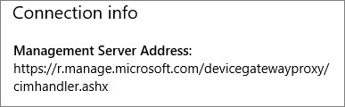
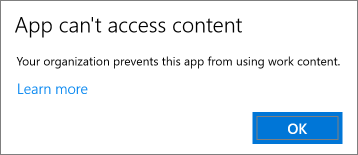
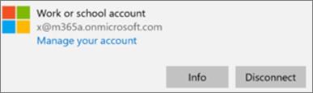
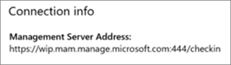

# Validere innstillingene for appbeskyttelse på Windows 10-datamaskiner

## Kontroller at brukere ikke kan kopiere firmadata til personlige filer på bedriftens enheter

Etter at du [har konfigurert policyer for appbeskyttelse](protection-settings-for-windows-10-devices.md), kan det ta opptil noen timer før policyen trer i kraft på brukernes enheter. Hvis du  har aktivert innstillingen Hindre brukere i å kopiere firmadata til personlige filer og tvinge dem til å lagre arbeidsfiler i **OneDrive for Business** for firmaeide enheter, kan du kontrollere dette på brukerens enhet etter at de har koblet til Azure AD og logget på. 
  
 **Kontrollere tilkoblingsinnstillinger**
  
1. Når du har logget på med Microsoft 365 Business Premium-legitimasjon og koblet til Azure AD som beskrevet i Konfigurere [Windows-enheter for Microsoft 365 Business Premium-brukere,](set-up-windows-devices.md)går du til **Windows-innstillinger** Kontoer Tilgang til jobb \>  \> **eller skole**. Velg **Koblet til Azure \<tenant name\> AD**, og velg deretter **Informasjon**.
    
    
  
2. På **Administrert av-siden** kan du se tilkoblingsinformasjonen som inneholder en Adresse for administrasjonsserver, som den som \<tenant name\> vises i figuren nedenfor.   
    
    
  
 **Kontroller at du ikke kan lime inn firmadata i en ikke-administrert app**
  
1. Åpne Outlook 2016 som ble installert av Microsoft 365 Business Premium.
    
2. Åpne en e-postmelding og kopier noe av innholdet fra den.
    
    Åpne Notisblokk, og prøv å lime inn innholdet.
    
    Du får en feilmelding som sier at appen ikke har tilgang til innhold.
    
    
  
    Du kan imidlertid lime inn det samme innholdet i Word 2016.
    
## Kontroller at brukere ikke kan kopiere firmadata til personlige filer på personlige enheter

 **Kontrollere tilkoblingsinnstillinger**
  
1. Gå til Windows-innstillinger på den personlige **Windows** 10-enheten der du er  logget på som en lokal bruker, og klikk eller trykk Kontoer Tilgang til jobb \> **eller skole.**
    
2. Velg **Koble til** under **Få tilgang til jobb eller skole**.
    
3. Skriv inn Microsoft 365 Business Premium-legitimasjonen i dialogboksen Konfigurer en jobb- eller **skolekonto** \> **Logg på**.
    
4. Velg **Få tilgang til jobb- eller skolekonto** på siden **Få tilgang til arbeidsplassen eller skolen**, og velg deretter **Informasjon**.
    
    
  
5. Du kan se Tilkoblingsinformasjon som  inneholder en **Adresse** for administrasjonsserver, som den som vises i figuren nedenfor, på siden **Access-jobb** eller skole, og inneholder ordene *wip* og *mam* inni. 
    
    
  
 **Kontroller at du ikke kan lime inn firmadata i en ikke-administrert app**
  
1. Åpne Outlook 2016, og legg til Microsoft 365 Business Premium-kontoen om nødvendig, og logg på med Microsoft 365 Business Premium-legitimasjonen.
    
2. Åpne en e-postmelding og kopier noe av innholdet fra den.
    
    Åpne Notisblokk, og prøv å lime inn innholdet.
    
    Du får en feilmelding om at appen ikke har tilgang til innhold.
    
    
  
    Du kan imidlertid lime inn det samme innholdet i Word 2016.
    

