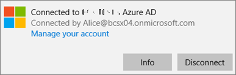

# Validere innstillingene for appbeskyttelse på Windows 10-datamaskinerValidate app protection settings on Windows 10 PCs

## Kontroller at brukere ikke kan kopiere firmadata til personlige filer på bedriftens enheterVerify that users cannot copy company data to personal files on corporate devices

Etter at du [har konfigurert policyer for appbeskyttelse](protection-settings-for-windows-10-devices.md), kan det ta opptil noen timer før policyen trer i kraft på brukernes enheter.After you [set up app protection policies](protection-settings-for-windows-10-devices.md), it may take up to a few hours for the policy to take effect on users' devices. Hvis du har slått **På** **Hindre brukere fra å kopiere firmadata til personlige filer og tvinge dem til å lagre arbeidsfiler til OneDrive for Business-innstillingen** for bedriftseide enheter, kan du sjekke dette på brukerens enhet etter at de har koblet til Azure AD og logget på.If you turned **On** the **Prevent users from copying company data to personal files and force them to save work files to OneDrive for Business** setting for company owned devices, you can check this on the user's device after they've connected to Azure AD and signed in. 
  
 **Kontrollere tilkoblingsinnstillinger****Verify connection settings**
  
1. Når du logger på med Microsoft 365 Business Premium-legitimasjon og kobler til Azure AD som beskrevet i [Konfigurere Windows-enheter for Microsoft 365 Business Premium-brukere,](set-up-windows-devices.md)kan du gå til **Windows Settings** \> **Accounts** \> **Access-arbeid eller skole**.After you sign in with Microsoft 365 Business Premium credentials and connect to Azure AD as described in [Set up Windows devices for Microsoft 365 Business Premium users](set-up-windows-devices.md), go to **Windows Settings** \> **Accounts** \> **Access work or school**. Velg **Koblet til Azure \<tenant name\> AD**, og velg deretter **Informasjon**.Choose **Connected to \<tenant name\> Azure AD**, and then choose **Info**.
    
    
  
2. På **administrert** \<tenant name\> av-siden kan du se **tilkoblingsinformasjonen** som inneholder en **Management Server-adresse** som den som vises i figuren nedenfor.On the **Managed by** \<tenant name\> page, you can see the **Connection info** that includes a **Management Server Address** like the one shown in the following figure. 
    
    
  
 **Kontroller at du ikke kan lime inn firmadata i en ikke-administrert app****Verify that you cannot paste company data in a non-managed app**
  
1. Åpne Outlook-2016 som ble installert av Microsoft 365 Business Premium.Open Outlook 2016 that was installed by Microsoft 365 Business Premium.
    
2. Åpne en e-postmelding og kopier noe av innholdet fra den.Open an email and copy some content from it.
    
    Åpne Notisblokk, og prøv å lime inn innholdet.Open Notepad and attempt to paste the content in.
    
    Du får en feilmelding som sier at appen ikke har tilgang til innhold.You'll receive an error that states the app can't access content.
    
    
  
    Du kan imidlertid lime inn det samme innholdet i Word 2016.You can, however, paste the same content into Word 2016.
    
## Kontroller at brukere ikke kan kopiere firmadata til personlige filer på personlige enheterVerify that users cannot copy company data to personal files on personal devices

 **Kontrollere tilkoblingsinnstillinger****Verify connection settings**
  
1. Gå til **Windows Innstillinger**på den personlige enheten for Windows 10 der du er logget på som lokal bruker, og klikk eller trykk **Kontoer** tilgang til arbeid \> **eller skole**.On your Windows 10 personal device where you're logged in as a local user, go to **Windows Settings**, and click or tap **Accounts** \> **Access work or school**.
    
2. Velg **Koble til** under **Få tilgang til jobb eller skole**.Under the **Access work or school**, choose **Connect**.
    
3. Angi Microsoft 365 Business Premium-legitimasjonen i **dialogboksen Konfigurer en jobb- eller skolekonto Logg** \> **på**.Enter your Microsoft 365 Business Premium credential into the **Set up a work or school account dialog** \> **Sign in**.
    
4. Velg **Få tilgang til jobb- eller skolekonto** på siden **Få tilgang til arbeidsplassen eller skolen**, og velg deretter **Informasjon**.On the **Access work or school** page, choose the **Work or school account**, and then choose **Info**.
    
    
  
5. På **siden For arbeid eller skole i Access** kan du se **tilkoblingsinformasjonen** som inneholder en **Management Server-adresse** som den som vises i figuren nedenfor, og inneholder ordene *wip* og *mam* i.On the **Access work or school** page, you can see the **Connection info** that includes a **Management Server Address** like the one shown in the following figure, and includes the words  *wip*  and  *mam*  within. 
    
    
  
 **Kontroller at du ikke kan lime inn firmadata i en ikke-administrert app****Verify that you cannot paste company data in a non-managed app**
  
1. Åpne Outlook 2016, og legg til Microsoft 365 Business Premium-kontoen om nødvendig, og logg på med Microsoft 365 Business Premium-legitimasjonen.Open Outlook 2016 and add your Microsoft 365 Business Premium account if necessary and sign in with your Microsoft 365 Business Premium credentials.
    
2. Åpne en e-postmelding og kopier noe av innholdet fra den.Open an email and copy some content from it.
    
    Åpne Notisblokk, og prøv å lime inn innholdet.Open Notepad and attempt to paste the content in.
    
    Du får en feilmelding som sier at App ikke har tilgang til innhold.You'll receive an error that states App can't access content.
    
    
  
    Du kan imidlertid lime inn det samme innholdet i Word 2016.You can, however, paste the same content into Word 2016.
    

