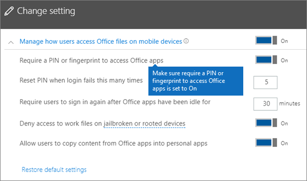

# Validere innstillinger for appbeskyttelse på Android- eller iOS-enheter

Følg instruksjonene i avsnittene nedenfor for å validere innstillinger for appbeskyttelse på Android- eller iOS-enheter.
  
## Android
  
### Kontroller at innstillingene for appbeskyttelse fungerer på brukerenheter

Når du har [angitt appkonfigurasjoner for Android-enheter](app-protection-settings-for-android-and-ios.md) for å beskytte appene, kan du følge disse trinnene for å validere at innstillingene du velger, fungerer. 
  
Kontroller først at retningslinjene gjelder for appen der du skal validere den.
  
1. Gå til **Policyer Rediger** **policyer** \> i [administrasjonssenteret](https://portal.office.com)for Microsoft 365 Business Premium .
    
2. Velg **Programpolicy for Android** for innstillingene du opprettet under konfigurasjonen, eller en annen policy du opprettet, og kontroller at den håndheves for Outlook, for eksempel. 
    
    
  
### Valider Krev en PIN-kode eller et fingeravtrykk for å få tilgang til Office-apper

Velg **Rediger** ved siden av **Tilgangskontroll for Office-dokumenter**, og utvid **Administrer hvordan brukere får tilgang til Office-filer på mobile enheter** i **Rediger policy**-ruten. Sørg for at **Krever en PIN eller et fingeravtrykk for å få tilgang til Office-apper** er satt til **På**.
  

  
1. Åpne Outlook på brukerens Android-enhet, og logg på med brukerens Microsoft 365 Business Premium-legitimasjon.
    
2. Du blir også bedt om å angi en PIN-kode eller bruke et fingeravtrykk.
    
    
  
### Valider Tilbakestill PIN-kode etter et antall mislykkede forsøk

I **rediger policy-ruten** velger du **Rediger** ved siden av **Tilgangskontroll for Office-dokumenter**, utvider **Administrer hvordan brukere får tilgang til Office-filer på mobile enheter**, og kontrollerer at **Tilbakestill PIN-kode etter antall mislykkede forsøk** er satt til et visst tall. Dette er 5 som standard. 
  
1. Åpne Outlook på brukerens Android-enhet, og logg på med brukerens Microsoft 365 Business Premium-legitimasjon.
    
2. Skriv inn feil PIN-kode så mange ganger som angitt av policyen. Du ser en melding som sier **PIN-forsøkgrense nådd** for å tilbakestille PIN-koden. 
    
    
  
3. Trykk på **tilbakestille PIN-kode**. Du blir bedt om å logge på med brukerens Microsoft 365 Business Premium-legitimasjon, og deretter må du angi en ny PIN-kode.
    
### Valider Tving brukere å lagre alle arbeidsfiler til OneDrive for Business

Velg **Rediger** ved siden av **Beskyttelse mot tapte eller stjålne enheter** i **Rediger policy**-ruten. Utvid **Beskytt arbeidsfiler når enheter går tapt eller stjålet**, og sørg for at **Tving brukere til å lagre alle arbeidsfiler til OneDrive for Business** er satt til **På**.
  

  
1. Åpne Outlook på brukerens Android-enhet, og logg på med brukerens Microsoft 365 Business Premium-legitimasjon, og skriv inn en PIN-kode hvis du blir bedt om det.
    
2. Åpne en e-postmelding som inneholder et vedlegg, og trykk på Pil ned-ikonet ved siden av vedleggsinformasjonen.
    
    
  
    Du ser **Kan ikke lagre på enheten** nederst på skjermen. 
    
    
  
    > [!NOTE]
    > Lagre på OneDrive for Business er for øyeblikket ikke aktivert for Android, slik at du bare ser at lagring lokalt er blokkert. 
  
### Valider Krev at brukeren logger på på nytt hvis Office-apper har vært inaktive i et angitt tidsrom

I **rediger policy-ruten** velger du **Rediger** ved siden av **Tilgangskontroll for Office-dokumenter**, utvider **Administrer hvordan brukere får tilgang til Office-filer på mobile enheter**, og kontrollerer at Krev brukere logger på nytt etter at **Office-apper er inaktive i,** er satt til et visst antall minutter. Dette er 30 minutter som standard. 
  
1. Åpne Outlook på brukerens Android-enhet, og logg på med brukerens Microsoft 365 Business Premium-legitimasjon, og skriv inn en PIN-kode hvis du blir bedt om det.
    
2. Du bør nå se innboksen til Outlook. La Android-enheten være uvirksom og urørt i minst 30 minutter (eller en annen tidsperiode, men lengre enn det du spesifiserte i policyen). Enheten vil sannsynligvis tone ned.
    
3. Få tilgang til Outlook på Android-enheten på nytt.
    
4. Du blir bedt om å angi PIN-koden før du får tilgang til Outlook på nytt.
    
### Valider Beskytt arbeidsfiler med kryptering

Velg **Rediger** ved siden av **Beskyttelse mot tapte eller stjålne enheter** i **Rediger policy**-ruten. Utvid **Beskytt arbeidsfiler når enheter går tapt eller stjålet**, og sørg for at **Beskytt arbeidsfiler med kryptering** er satt til **På** og **Tvinge brukere å lagre alle arbeidsfiler til OneDrive for Business** er satt til **Av**.
  
1. Åpne Outlook på brukerens Android-enhet, og logg på med brukerens Microsoft 365 Business Premium-legitimasjon, og skriv inn en PIN-kode hvis du blir bedt om det.
    
2. Åpne en e-post som inneholder noen bildefilvedlegg.
    
3. Trykk på Pil ned-ikonet ved siden av vedleggsinformasjonen for å lagre den.
    
    
  
4. Du kan bli bedt om å gi Outlook tilgang til bildene, medier og filer på enheten. Trykk på **Tillat**.
    
5. Nederst på skjermen kan du velge å **Lagre til enhet** og deretter åpne **Galleri** -appen. 
    
6. Du bør nå se et kryptert bilde (eller flere hvis du har lagret flere bildefilvedlegg) i listen. Bildet kan vises på bildelisten som en grå firkant med et hvitt utropstegn inne i en hvit sirkel midt på den grå firkanten.
    
    
  
## Ios
  
### Kontroller at innstillingene for appbeskyttelse fungerer på brukerenheter

Når du har [angitt appkonfigurasjoner for iOS-enheter](app-protection-settings-for-android-and-ios.md) for å beskytte apper, kan du følge disse trinnene for å validere at innstillingene du velger, fungerer. 
  
Kontroller først at retningslinjene gjelder for appen der du skal validere den.
  
1. Gå til **Policyer Rediger** **policyer** \> i [administrasjonssenteret](https://portal.office.com)for Microsoft 365 Business Premium .
    
2. Velg **Programpolicy for iOS** for innstillingene du opprettet under installasjonen, eller en annen policy du opprettet, og kontroller at den for eksempel håndheves for Outlook. 
    
    
  
### Valider Krev en PIN-kode å få tilgang til Office-apper

Velg **Rediger** ved siden av **Tilgangskontroll for Office-dokumenter**, og utvid **Administrer hvordan brukere får tilgang til Office-filer på mobile enheter** i **Rediger policy**-ruten. Sørg for at **Krever en PIN eller et fingeravtrykk for å få tilgang til Office-apper** er satt til **På**.
  

  
1. Åpne Outlook på brukerens iOS-enhet, og logg på med brukerens Microsoft 365 Business Premium-legitimasjon.
    
2. Du blir også bedt om å angi en PIN-kode eller bruke et fingeravtrykk.
    
    
  
### Valider Tilbakestill PIN-kode etter et antall mislykkede forsøk

I **rediger policy-ruten** velger du **Rediger** ved siden av **Tilgangskontroll for Office-dokumenter**, utvider **Administrer hvordan brukere får tilgang til Office-filer på mobile enheter**, og kontrollerer at **Tilbakestill PIN-kode etter antall mislykkede forsøk** er satt til et visst tall. Dette er 5 som standard. 
  
1. Åpne Outlook på brukerens iOS-enhet, og logg på med brukerens Microsoft 365 Business Premium-legitimasjon.
    
2. Skriv inn feil PIN-kode så mange ganger som angitt av policyen. Du ser en melding som sier **PIN-forsøkgrense nådd** for å tilbakestille PIN-koden. 
    
    
  
3. Trykk på **OK**. Du blir bedt om å logge på med brukerens Microsoft 365 Business Premium-legitimasjon, og deretter må du angi en ny PIN-kode.
    
### Valider Tving brukere å lagre alle arbeidsfiler til OneDrive for Business

Velg **Rediger** ved siden av **Beskyttelse mot tapte eller stjålne enheter** i **Rediger policy**-ruten. Utvid **Beskytt arbeidsfiler når enheter går tapt eller stjålet**, og sørg for at **Tving brukere til å lagre alle arbeidsfiler til OneDrive for Business** er satt til **På**.
  

  
1. Åpne Outlook på brukerens iOS-enhet, og logg på med brukerens Microsoft 365 Business Premium-legitimasjon, og skriv inn en PIN-kode hvis du blir bedt om det.
    
2. Åpne en e-postmelding som inneholder et vedlegg, åpne vedlegget, og velg **Lagre** nederst på skjermen. 
    
    
  
3. Du bør nå bare se alternativet for OneDrive for Business. Hvis ikke, trykker du **Legg til konto** og velger **OneDrive for Bedrifter** fra skjermbildet Legg til **lagringskonto.** Oppgi sluttbrukerens Microsoft 365 Business Premium for å logge på når du blir bedt om det. 
    
    Trykk på **Lagre**, og velg **OneDrive for Business**.
    
### Valider Krev at brukeren logger på på nytt hvis Office-apper har vært inaktive i et angitt tidsrom

I **rediger policy-ruten** velger du **Rediger** ved siden av **Tilgangskontroll for Office-dokumenter**, utvider **Administrer hvordan brukere får tilgang til Office-filer på mobile enheter**, og kontrollerer at Krev brukere logger på nytt etter at **Office-apper er inaktive i,** er satt til et visst antall minutter. Dette er 30 minutter som standard. 
  
1. Åpne Outlook på brukerens iOS-enhet, og logg på med brukerens Microsoft 365 Business Premium-legitimasjon, og skriv inn en PIN-kode hvis du blir bedt om det.
    
2. Du bør nå se innboksen til Outlook. La iOS-enheten være uberørt i minst 30 minutter (eller en annen tidsperiode, men lengre enn det du spesifiserte i policyen). Enheten vil sannsynligvis tone ned.
    
3. Få tilgang til Outlook på iOS-enheten på nytt.
    
4. Du blir bedt om å angi PIN-koden før du får tilgang til Outlook på nytt.
    
### Valider Beskytt arbeidsfiler med kryptering

Velg **Rediger** ved siden av **Beskyttelse mot tapte eller stjålne enheter** i **Rediger policy**-ruten. Utvid **Beskytt arbeidsfiler når enheter går tapt eller stjålet**, og sørg for at **Beskytt arbeidsfiler med kryptering** er satt til **På** og **Tvinge brukere å lagre alle arbeidsfiler til OneDrive for Business** er satt til **Av**.
  
1. Åpne Outlook på brukerens iOS-enhet, og logg på med brukerens Microsoft 365 Business Premium-legitimasjon, og skriv inn en PIN-kode hvis du blir bedt om det.
    
2. Åpne en e-post som inneholder noen bildefilvedlegg.
    
3. Trykk på vedlegget, og trykk deretter på **Lagre**-alternativet under vedlegget. 
    
4. Åpne **Bilde**-appen på startskjermen. Du bør nå se et kryptert bilde (eller flere hvis du har lagret flere bildefilvedlegg) som er lagret, men kryptert. 
    
---

