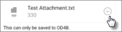

# Validere innstillinger for appbeskyttelse på Android- eller iOS-enheterValidate app protection settings on Android or iOS devices

Følg instruksjonene i avsnittene nedenfor for å validere innstillinger for appbeskyttelse på Android- eller iOS-enheter.Follow the instructions in the following sections to validate app protection settings on Android or iOS devices.
  
## AndroidAndroid
  
### Kontroller at innstillingene for appbeskyttelse fungerer på brukerenheterCheck that the app protection settings are working on user devices

Når du har [angitt appkonfigurasjoner for Android-enheter](app-protection-settings-for-android-and-ios.md) for å beskytte appene, kan du følge disse trinnene for å validere at innstillingene du velger, fungerer.After you [set app configurations for Android devices](app-protection-settings-for-android-and-ios.md) to protect the apps, you can follow these steps to validate that the settings you chose work. 
  
Kontroller først at retningslinjene gjelder for appen der du skal validere den.First, make sure that the policy applies to the app in which you're going to validate it.
  
1. Gå til **Policyer Rediger** **policyer** \> i [administrasjonssenteret](https://portal.office.com)for Microsoft 365 Business Premium .In the Microsoft 365 Business Premium [admin center](https://portal.office.com), go to **Policies** \> **Edit policy**.
    
2. Velg **Programpolicy for Android** for innstillingene du opprettet under konfigurasjonen, eller en annen policy du opprettet, og kontroller at den håndheves for Outlook, for eksempel.Choose **Application policy for Android** for the settings you created at setup, or another policy you created, and verify that it's enforced for Outlook, for example. 
    
    
  
### Valider Krev en PIN-kode eller et fingeravtrykk for å få tilgang til Office-apperValidate Require a PIN or a fingerprint to access Office apps

Velg **Rediger** ved siden av **Tilgangskontroll for Office-dokumenter**, og utvid **Administrer hvordan brukere får tilgang til Office-filer på mobile enheter** i **Rediger policy**-ruten. Sørg for at **Krever en PIN eller et fingeravtrykk for å få tilgang til Office-apper** er satt til **På**.In the **Edit policy** pane, choose **Edit** next to **Office documents access control**, expand **Manage how users access Office files on mobile devices**, and make sure that **Require a PIN or fingerprint to access Office apps** is set to **On**.
  

  
1. Åpne Outlook på brukerens Android-enhet, og logg på med brukerens Microsoft 365 Business Premium-legitimasjon.In the user's Android device, open Outlook and sign in with the user's Microsoft 365 Business Premium credentials.
    
2. Du blir også bedt om å angi en PIN-kode eller bruke et fingeravtrykk.You'll also be prompted to enter a PIN or use a fingerprint.
    
    
  
### Valider Tilbakestill PIN-kode etter et antall mislykkede forsøkValidate Reset PIN after number of failed attempts

I **rediger policy-ruten** velger du **Rediger** ved siden av **Tilgangskontroll for Office-dokumenter**, utvider **Administrer hvordan brukere får tilgang til Office-filer på mobile enheter**, og kontrollerer at **Tilbakestill PIN-kode etter antall mislykkede forsøk** er satt til et visst tall.In the **Edit policy** pane, choose **Edit** next to **Office documents access control**, expand **Manage how users access Office files on mobile devices**, and make sure that **Reset PIN after number of failed attempts** is set to some number. Dette er 5 som standard.This is 5 by default. 
  
1. Åpne Outlook på brukerens Android-enhet, og logg på med brukerens Microsoft 365 Business Premium-legitimasjon.In the user's Android device, open Outlook and sign in with the user's Microsoft 365 Business Premium credentials.
    
2. Skriv inn feil PIN-kode så mange ganger som angitt av policyen.Enter an incorrect PIN as many times as specified by the policy. Du ser en melding som sier **PIN-forsøkgrense nådd** for å tilbakestille PIN-koden.You'll see a prompt that states **PIN Attempt Limit Reached** to reset the PIN. 
    
    
  
3. Trykk på **tilbakestille PIN-kode**.Press **Reset PIN**. Du blir bedt om å logge på med brukerens Microsoft 365 Business Premium-legitimasjon, og deretter må du angi en ny PIN-kode.You'll be prompted to sign in with the user's Microsoft 365 Business Premium credentials, and then required to set a new PIN.
    
### Valider Tving brukere å lagre alle arbeidsfiler til OneDrive for BusinessValidate Force users to save all work files to OneDrive for Business

Velg **Rediger** ved siden av **Beskyttelse mot tapte eller stjålne enheter** i **Rediger policy**-ruten. Utvid **Beskytt arbeidsfiler når enheter går tapt eller stjålet**, og sørg for at **Tving brukere til å lagre alle arbeidsfiler til OneDrive for Business** er satt til **På**.In the **Edit policy** pane, choose **Edit** next to **Protection against lost or stolen devices**, expand **Protect work files when devices are lost or stolen**, and make sure that **Force users to save all work files to OneDrive for Business** is set to **On**.
  

  
1. Åpne Outlook på brukerens Android-enhet, og logg på med brukerens Microsoft 365 Business Premium-legitimasjon, og skriv inn en PIN-kode hvis du blir bedt om det.In the user's Android device, open Outlook and sign in with the user's Microsoft 365 Business Premium credentials, and enter a PIN if requested.
    
2. Åpne en e-postmelding som inneholder et vedlegg, og trykk på Pil ned-ikonet ved siden av vedleggsinformasjonen.Open an email that contains an attachment and tap the down arrow icon next to the attachment's information.
    
    
  
    Du ser **Kan ikke lagre på enheten** nederst på skjermen.You'll see **Cannot save to device** on the bottom of the screen. 
    
    
  
    > [!NOTE]
    > Lagre på OneDrive for Business er for øyeblikket ikke aktivert for Android, slik at du bare ser at lagring lokalt er blokkert.Saving to OneDrive for Business is not enabled for Android at this time, so you can only see that saving locally is blocked. 
  
### Valider Krev at brukeren logger på på nytt hvis Office-apper har vært inaktive i et angitt tidsromValidate Require user to sign in again if Office apps have been idle for a specified time

I **rediger policy-ruten** velger du **Rediger** ved siden av **Tilgangskontroll for Office-dokumenter**, utvider **Administrer hvordan brukere får tilgang til Office-filer på mobile enheter**, og kontrollerer at Krev brukere logger på nytt etter at **Office-apper er inaktive i,** er satt til et visst antall minutter.In the **Edit policy** pane, choose **Edit** next to **Office documents access control**, expand **Manage how users access Office files on mobile devices**, and make sure that **Require users to sign in again after Office apps have been idle for** is set to some number of minutes. Dette er 30 minutter som standard.This is 30 minutes by default. 
  
1. Åpne Outlook på brukerens Android-enhet, og logg på med brukerens Microsoft 365 Business Premium-legitimasjon, og skriv inn en PIN-kode hvis du blir bedt om det.In the user's Android device, open Outlook and sign in with the user's Microsoft 365 Business Premium credentials, and enter a PIN if requested.
    
2. Du bør nå se innboksen til Outlook. La Android-enheten være uvirksom og urørt i minst 30 minutter (eller en annen tidsperiode, men lengre enn det du spesifiserte i policyen). Enheten vil sannsynligvis tone ned.You should now see Outlook's inbox. Let the Android device idle untouched for at least 30 minutes (or some other amount of time, longer than what you specified in the policy). The device will likely dim.
    
3. Få tilgang til Outlook på Android-enheten på nytt.Access Outlook on the Android device again.
    
4. Du blir bedt om å angi PIN-koden før du får tilgang til Outlook på nytt.You'll be prompted to enter your PIN before you can access Outlook again.
    
### Valider Beskytt arbeidsfiler med krypteringValidate Protect work files with encryption

Velg **Rediger** ved siden av **Beskyttelse mot tapte eller stjålne enheter** i **Rediger policy**-ruten. Utvid **Beskytt arbeidsfiler når enheter går tapt eller stjålet**, og sørg for at **Beskytt arbeidsfiler med kryptering** er satt til **På** og **Tvinge brukere å lagre alle arbeidsfiler til OneDrive for Business** er satt til **Av**.In the **Edit policy** pane, choose **Edit** next to **Protection against lost or stolen devices**, expand **Protect work files when devices are lost or stolen**, and make sure that **Protect work files with encryption** is set to **On**, and **Force users to save all work files to OneDrive for Business** is set to **Off**.
  
1. Åpne Outlook på brukerens Android-enhet, og logg på med brukerens Microsoft 365 Business Premium-legitimasjon, og skriv inn en PIN-kode hvis du blir bedt om det.In the user's Android device, open Outlook and sign in with the user's Microsoft 365 Business Premium credentials, and enter a PIN if requested.
    
2. Åpne en e-post som inneholder noen bildefilvedlegg.Open an email that contains a few image file attachments.
    
3. Trykk på Pil ned-ikonet ved siden av vedleggsinformasjonen for å lagre den.Tap the down arrow icon next to the attachment's info to save it.
    
    
  
4. Du kan bli bedt om å gi Outlook tilgang til bildene, medier og filer på enheten. Trykk på **Tillat**.You may be prompted to allow Outlook to access photos, media, and files on your device. Tap **Allow**.
    
5. Nederst på skjermen kan du velge å **Lagre til enhet** og deretter åpne **Galleri** -appen.At the bottom of the screen, choose to **Save to Device** and then open the **Gallery** app. 
    
6. Du bør nå se et kryptert bilde (eller flere hvis du har lagret flere bildefilvedlegg) i listen. Bildet kan vises på bildelisten som en grå firkant med et hvitt utropstegn inne i en hvit sirkel midt på den grå firkanten.You should see an encrypted photo (or more, if you saved multiple image file attachments) in the list. It may appear in the Pictures list as a gray square with a white exclamation point within a white circle in the center of the gray square.
    
    
  
## IosiOS
  
### Kontroller at innstillingene for appbeskyttelse fungerer på brukerenheterCheck that the App protection settings are working on user devices

Når du har [angitt appkonfigurasjoner for iOS-enheter](app-protection-settings-for-android-and-ios.md) for å beskytte apper, kan du følge disse trinnene for å validere at innstillingene du velger, fungerer.After you [set app configurations for iOS devices](app-protection-settings-for-android-and-ios.md) to protect apps, you can follow these steps to validate that the settings you chose work. 
  
Kontroller først at retningslinjene gjelder for appen der du skal validere den.First, make sure that the policy applies to the app in which you're going to validate it.
  
1. Gå til **Policyer Rediger** **policyer** \> i [administrasjonssenteret](https://portal.office.com)for Microsoft 365 Business Premium .In the Microsoft 365 Business Premium [admin center](https://portal.office.com), go to **Policies** \> **Edit policy**.
    
2. Velg **Programpolicy for iOS** for innstillingene du opprettet under installasjonen, eller en annen policy du opprettet, og kontroller at den for eksempel håndheves for Outlook.Choose **Application policy for iOS** for the settings you created at setup, or another policy you created, and verify that it's enforced for Outlook for example. 
    
    
  
### Valider Krev en PIN-kode å få tilgang til Office-apperValidate Require a PIN to access Office apps

Velg **Rediger** ved siden av **Tilgangskontroll for Office-dokumenter**, og utvid **Administrer hvordan brukere får tilgang til Office-filer på mobile enheter** i **Rediger policy**-ruten. Sørg for at **Krever en PIN eller et fingeravtrykk for å få tilgang til Office-apper** er satt til **På**.In the **Edit policy** pane, choose **Edit** next to **Office documents access control**, expand **Manage how users access Office files on mobile devices**, and make sure that **Require a PIN or fingerprint to access Office apps** is set to **On**.
  

  
1. Åpne Outlook på brukerens iOS-enhet, og logg på med brukerens Microsoft 365 Business Premium-legitimasjon.In the user's iOS device, open Outlook and sign in with the user's Microsoft 365 Business Premium credentials.
    
2. Du blir også bedt om å angi en PIN-kode eller bruke et fingeravtrykk.You'll also be prompted to enter a PIN or use a fingerprint.
    
    
  
### Valider Tilbakestill PIN-kode etter et antall mislykkede forsøkValidate Reset PIN after number of failed attempts

I **rediger policy-ruten** velger du **Rediger** ved siden av **Tilgangskontroll for Office-dokumenter**, utvider **Administrer hvordan brukere får tilgang til Office-filer på mobile enheter**, og kontrollerer at **Tilbakestill PIN-kode etter antall mislykkede forsøk** er satt til et visst tall.In the **Edit policy** pane, choose **Edit** next to **Office documents access control**, expand **Manage how users access Office files on mobile devices**, and make sure that **Reset PIN after number of failed attempts** is set to some number. Dette er 5 som standard.This is 5 by default. 
  
1. Åpne Outlook på brukerens iOS-enhet, og logg på med brukerens Microsoft 365 Business Premium-legitimasjon.In the user's iOS device, open Outlook and sign in with the user's Microsoft 365 Business Premium credentials.
    
2. Skriv inn feil PIN-kode så mange ganger som angitt av policyen.Enter an incorrect PIN as many times as specified by the policy. Du ser en melding som sier **PIN-forsøkgrense nådd** for å tilbakestille PIN-koden.You'll see a prompt that states **PIN Attempt Limit Reached** to reset the PIN. 
    
    
  
3. Trykk på **OK**.Press **OK**. Du blir bedt om å logge på med brukerens Microsoft 365 Business Premium-legitimasjon, og deretter må du angi en ny PIN-kode.You'll be prompted to sign in with the user's Microsoft 365 Business Premium credentials, and then required to set a new PIN.
    
### Valider Tving brukere å lagre alle arbeidsfiler til OneDrive for BusinessValidate Force users to save all work files to OneDrive for Business

Velg **Rediger** ved siden av **Beskyttelse mot tapte eller stjålne enheter** i **Rediger policy**-ruten. Utvid **Beskytt arbeidsfiler når enheter går tapt eller stjålet**, og sørg for at **Tving brukere til å lagre alle arbeidsfiler til OneDrive for Business** er satt til **På**.In the **Edit policy** pane, choose **Edit** next to **Protection against lost or stolen devices**, expand **Protect work files when devices are lost or stolen**, and make sure that **Force users to save all work files to OneDrive for Business** is set to **On**.
  

  
1. Åpne Outlook på brukerens iOS-enhet, og logg på med brukerens Microsoft 365 Business Premium-legitimasjon, og skriv inn en PIN-kode hvis du blir bedt om det.In the user's iOS device, open Outlook and sign in with the user's Microsoft 365 Business Premium credentials, and enter a PIN if requested.
    
2. Åpne en e-postmelding som inneholder et vedlegg, åpne vedlegget, og velg **Lagre** nederst på skjermen.Open an email that contains an attachment, open the attachment and choose **Save** on the bottom of the screen. 
    
    
  
3. Du bør nå bare se alternativet for OneDrive for Business.You should only see an option for OneDrive for Business. Hvis ikke, trykker du **Legg til konto** og velger **OneDrive for Bedrifter** fra skjermbildet Legg til **lagringskonto.**If not, tap **Add Account** and select **OneDrive for Business** from the **Add Storage Account** screen. Oppgi sluttbrukerens Microsoft 365 Business Premium for å logge på når du blir bedt om det.Provide the end user's Microsoft 365 Business Premium to sign in when prompted. 
    
    Trykk på **Lagre**, og velg **OneDrive for Business**.Tap **Save** and select **OneDrive for Business**.
    
### Valider Krev at brukeren logger på på nytt hvis Office-apper har vært inaktive i et angitt tidsromValidate Require user to sign in again if Office apps have been idle for a specified time

I **rediger policy-ruten** velger du **Rediger** ved siden av **Tilgangskontroll for Office-dokumenter**, utvider **Administrer hvordan brukere får tilgang til Office-filer på mobile enheter**, og kontrollerer at Krev brukere logger på nytt etter at **Office-apper er inaktive i,** er satt til et visst antall minutter.In the **Edit policy** pane, choose **Edit** next to **Office documents access control**, expand **Manage how users access Office files on mobile devices**, and make sure that **Require users to sign in again after Office apps have been idle for** is set to some number of minutes. Dette er 30 minutter som standard.This is 30 minutes by default. 
  
1. Åpne Outlook på brukerens iOS-enhet, og logg på med brukerens Microsoft 365 Business Premium-legitimasjon, og skriv inn en PIN-kode hvis du blir bedt om det.In the user's iOS device, open Outlook and sign in with the user's Microsoft 365 Business Premium credentials, and enter a PIN if requested.
    
2. Du bør nå se innboksen til Outlook. La iOS-enheten være uberørt i minst 30 minutter (eller en annen tidsperiode, men lengre enn det du spesifiserte i policyen). Enheten vil sannsynligvis tone ned.You should now see Outlook's inbox. Let the iOS device untouched for at least 30 minutes (or some other amount of time, longer than what you specified in the policy). The device will likely dim.
    
3. Få tilgang til Outlook på iOS-enheten på nytt.Access Outlook on the iOS device again.
    
4. Du blir bedt om å angi PIN-koden før du får tilgang til Outlook på nytt.You'll be prompted to enter your PIN before you can access Outlook again.
    
### Valider Beskytt arbeidsfiler med krypteringValidate Protect work files with encryption

Velg **Rediger** ved siden av **Beskyttelse mot tapte eller stjålne enheter** i **Rediger policy**-ruten. Utvid **Beskytt arbeidsfiler når enheter går tapt eller stjålet**, og sørg for at **Beskytt arbeidsfiler med kryptering** er satt til **På** og **Tvinge brukere å lagre alle arbeidsfiler til OneDrive for Business** er satt til **Av**.In the **Edit policy** pane, choose **Edit** next to **Protection against lost or stolen devices**, expand **Protect work files when devices are lost or stolen**, and make sure that **Protect work files with encryption** is set to **On**, and **Force users to save all work files to OneDrive for Business** is set to **Off**.
  
1. Åpne Outlook på brukerens iOS-enhet, og logg på med brukerens Microsoft 365 Business Premium-legitimasjon, og skriv inn en PIN-kode hvis du blir bedt om det.In the user's iOS device, open Outlook and sign in with the user's Microsoft 365 Business Premium credentials, and enter a PIN if requested.
    
2. Åpne en e-post som inneholder noen bildefilvedlegg.Open an email that contains a few image file attachments.
    
3. Trykk på vedlegget, og trykk deretter på **Lagre**-alternativet under vedlegget.Tap the attachment and then tap the **Save** option under it. 
    
4. Åpne **Bilde**-appen på startskjermen. Du bør nå se et kryptert bilde (eller flere hvis du har lagret flere bildefilvedlegg) som er lagret, men kryptert.Open **Photos** app from the home screen. You should see an encrypted photo (or more, if you saved multiple image file attachments) saved, but encrypted. 
    
---

