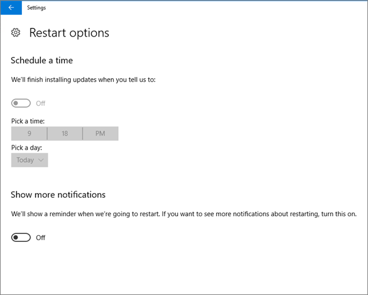
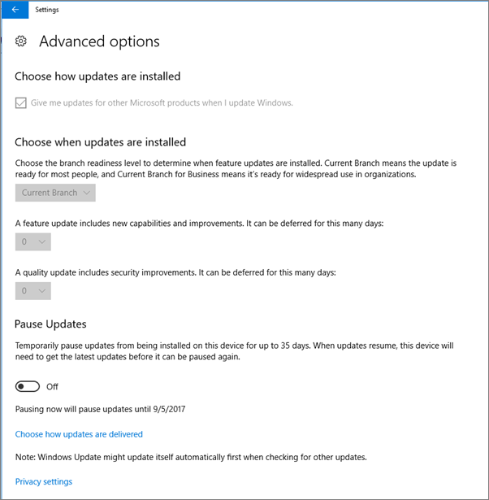
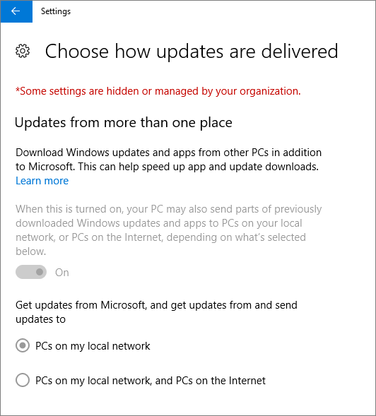

# Validere innstillinger for enhetsbeskyttelse for Windows 10-PC-er

## Kontroller at windows 10-enhetspolicyer er angitt

Når du [har konfigurert policyer](protection-settings-for-windows-10-pcs.md)for enheter, kan det ta opptil et par timer før policyen trer i kraft på brukernes enheter. Du kan bekrefte at policyene trer i kraft ved å se på ulike Skjermbilder for Windows-innstillinger på brukernes enheter. Fordi brukerne ikke kan endre Windows Update- og Windows Defender Antivirus-innstillingene på Windows 10-enhetene sine, vil mange alternativer være nedtonet.
  
1. Gå til **Innstillinger** \> **Oppdater &amp; sikkerhetsalternativer** \> **for Windows Update Start** på \> **nytt,** og bekreft at alle innstillingene er nedtonet. 
    
    
  
2. Gå til **Innstillinger Oppdater** \> **sikkerhet &amp; Windows** \> **Update** \> **Avanserte alternativer** og bekreft at alle innstillingene er nedtonet. 
    
    
  
3. Gå til **Innstillinger Oppdater** \> **sikkerhet &amp; Windows** \> **Update** \> **Avanserte alternativer** \> **Velg hvordan oppdateringer skal leveres**.
    
    Bekreft at du kan se meldingen (i rødt) om at noen innstillinger er skjult eller administrert av organisasjonen, og at alle alternativene er nedtonet.
    
    
  
4. Hvis du vil åpne Windows Defender Sikkerhetssenter, går du til Innstillinger  Oppdater sikkerhet Windows Defender og klikker Åpne Windows \> **&amp;** \>  \> **Defender Security Center** Virus thread \> **&amp; protection** Virus threat protection \> **&amp; settings**. 
    
5. Kontroller at alle alternativene er nedtonet. 
    
    
  
## Beslektede emner

[Dokumentasjon og ressurser for Microsoft 365 for bedrifter](./index.yml)
  
[Komme i gang med Microsoft 365 for bedrifter](microsoft-365-business-overview.md)
  
[Administrere Microsoft 365 for bedrifter](manage.md)
  
[Angi enhetskonfigurasjoner for PC-er med Windows 10](protection-settings-for-windows-10-pcs.md)
