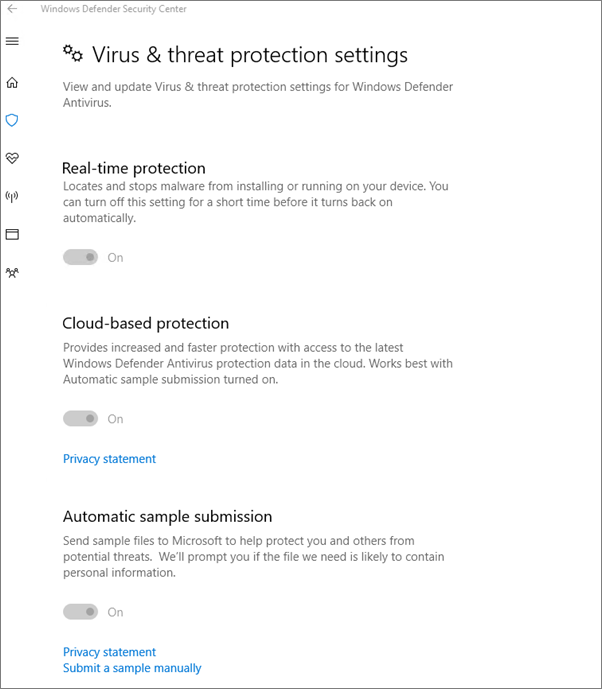

# Validere innstillinger for enhetsbeskyttelse for Windows 10-PC-erValidate device protection settings for Windows 10 PCs

## Kontroller at windows 10-enhetspolicyer er angittVerify that Windows 10 device policies are set

Når du [har konfigurert policyer](protection-settings-for-windows-10-pcs.md)for enheter, kan det ta opptil et par timer før policyen trer i kraft på brukernes enheter.After you [set up devices policies](protection-settings-for-windows-10-pcs.md), it may take up to a few hours for the policy to take effect on users' devices. Du kan bekrefte at policyene trer i kraft ved å se på ulike Skjermbilder for Windows-innstillinger på brukernes enheter.You can confirm that the policies took effect by looking at various Windows Settings screens on the users' devices. Fordi brukerne ikke kan endre Windows Update- og Windows Defender Antivirus-innstillingene på Windows 10-enhetene sine, vil mange alternativer være nedtonet.Because the users won't be able to modify the Windows Update and Windows Defender Antivirus settings on their Windows 10 devices, many options will be grayed out.
  
1. Gå til **Innstillinger** \> **Oppdater &amp; sikkerhetsalternativer** \> **for Windows Update Start** på \> **nytt,** og bekreft at alle innstillingene er nedtonet.Go to **Settings** \> **Update &amp; security** \> **Windows Update** \> **Restart options** and confirm that all settings are grayed out. 
    
    
  
2. Gå til **Innstillinger Oppdater** \> **sikkerhet &amp; Windows** \> **Update** \> **Avanserte alternativer** og bekreft at alle innstillingene er nedtonet.Go to **Settings** \> **Update &amp; security** \> **Windows Update** \> **Advanced options** and confirm that all settings are grayed out. 
    
    
  
3. Gå til **Innstillinger Oppdater** \> **sikkerhet &amp; Windows** \> **Update** \> **Avanserte alternativer** \> **Velg hvordan oppdateringer skal leveres**.Go to **Settings** \> **Update &amp; security** \> **Windows Update** \> **Advanced options** \> **Choose how updates are delivered**.
    
    Bekreft at du kan se meldingen (i rødt) om at noen innstillinger er skjult eller administrert av organisasjonen, og at alle alternativene er nedtonet.Confirm that you can see the message (in red) that some settings are hidden or managed by your organization, and all the options are grayed out.
    
    
  
4. Hvis du vil åpne Windows Defender Sikkerhetssenter, går du til Innstillinger  Oppdater sikkerhet Windows Defender og klikker Åpne Windows \> **&amp;** \>  \> **Defender Security Center** Virus thread \> **&amp; protection** Virus threat protection \> **&amp; settings**.To open the Windows Defender Security Center, go to **Settings** \> **Update &amp; security** \> **Windows Defender** \> click **Open Windows Defender Security Center** \> **Virus &amp; thread protection** \> **Virus &amp; threat protection settings**. 
    
5. Kontroller at alle alternativene er nedtonet.Verify that all options are grayed out. 
    
    
  
## Beslektede emnerRelated Topics

[Dokumentasjon og ressurser for Microsoft 365 for bedrifterMicrosoft 365 for business documentation and resources](./index.yml)
  
[Komme i gang med Microsoft 365 for bedrifterGet started with Microsoft 365 for business](microsoft-365-business-overview.md)
  
[Administrere Microsoft 365 for bedrifterManage Microsoft 365 for business](manage.md)
  
[Angi enhetskonfigurasjoner for PC-er med Windows 10Set device configurations for Windows 10 PCs](protection-settings-for-windows-10-pcs.md)
