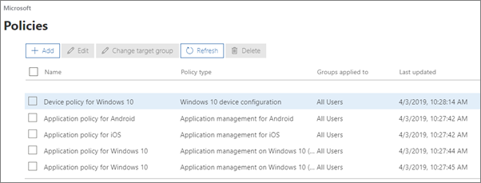
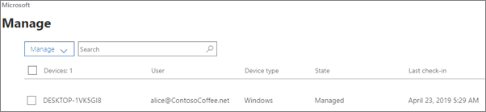

# Vise og administrere policyer og enheterView and manage policies and devices

Denne artikkelen gjelder for Microsoft 365 Business Premium.This article applies to Microsoft 365 Business Premium.

## Vise og redigere enhetspolicyerView and edit device policies

1.  Gå til administrasjonssenteret på <a href="https://go.microsoft.com/fwlink/p/?linkid=837890" target="_blank">https://admin.microsoft.com</a> .Go to the admin center at <a href="https://go.microsoft.com/fwlink/p/?linkid=837890" target="_blank">https://admin.microsoft.com</a>.
2. Velg **Enhetspolicyer** i venstre \> **navigasjonsrute.**On the left nav, choose **Devices** \> **Policies**.

    På denne siden kan du opprette, redigere, endre målgruppe eller slette en policy.On this page, you can create, edit, change target group, or delete a policy.

    
  
## Vise og administrere enheterView and manage devices

1. Velg **Enheter** administrere på venstre \> **Manage**navigasjonsrute.On the left nav, choose **Devices** \> **Manage**. 
    
    På denne siden kan du velge én eller flere enheter og fjerne firmadata.On this page, you can select one or more devices and remove company data. Hvis du har Windows 10-enheter der du har angitt innstillinger for enhetsbeskyttelse, kan du også velge å gjenopprette fabrikkinnstillinger på dem.For Windows 10 devices that you have set device protections settings for, you can also choose to reset the device to factory settings.
  
   

